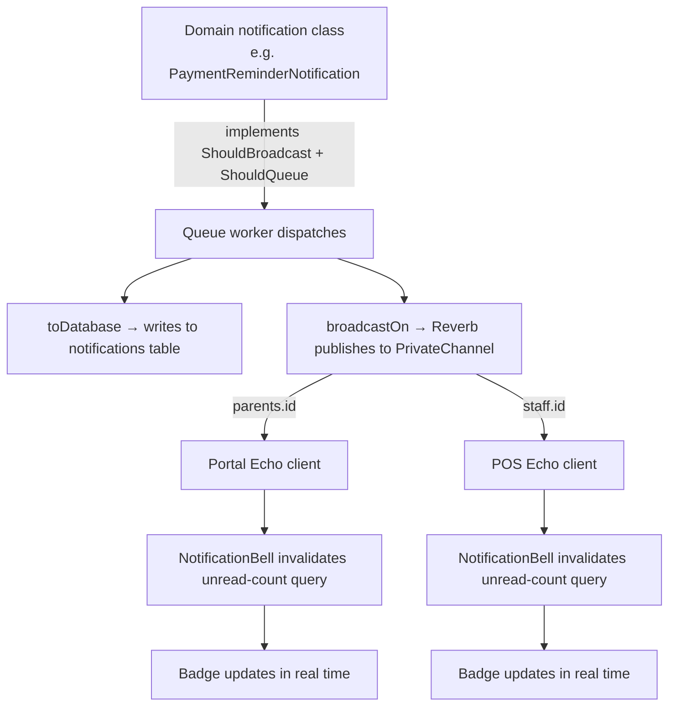

# Spec 10 — Notifications Design

## Overview

The notification system is the shared infrastructure that all real-time features (payment reminders, announcements, pre-registration alerts) depend on. It uses **Laravel Reverb** as the WebSocket server and the Laravel `notifications` table for persistence.

Two distinct private channel namespaces exist:
- `parents.{id}` — for `ParentUser` recipients (portal app)
- `staff.{id}` — for `User` recipients (POS app)

---

## Architecture



---

## Database

### `notifications` table (Laravel built-in)

Generated by `php artisan notifications:table`. Polymorphic — both `ParentUser` and `User` use it.

```
notifications
  id              (uuid, PK)
  type            (string)      — FQCN of the notification class
  notifiable_type (string)      — "App\Models\ParentUser" or "App\Models\User"
  notifiable_id   (bigint)
  data            (json)        — notification payload
  read_at         (timestamp, nullable)
  created_at, updated_at
```

No soft deletes — hard delete only.

---

## Channel Authorization

`routes/channels.php`:

```php
Broadcast::channel('parents.{parentId}', function (ParentUser $user, int $parentId) {
    return $user->id === $parentId;
});

Broadcast::channel('staff.{userId}', function (User $user, int $userId) {
    return $user->id === $userId;
});
```

Broadcast auth routes are registered inside the authenticated route groups (not via `Broadcast::routes()` at the top level) so they inherit the `/api/v1/` prefix and the correct guard:

```php
// routes/portal-api.php — inside auth:parents group
Route::post('/broadcasting/auth', [BroadcastController::class, 'authenticate']);

// routes/kitchen-api.php — inside auth:sanctum group
Route::post('/broadcasting/auth', [BroadcastController::class, 'authenticate']);
```

---

## EchoProvider Pattern

Both apps use the same Client Component pattern. The provider:
1. Reads the Sanctum Bearer token from the Zustand auth store
2. Initialises a `laravel-echo` instance with Reverb config
3. Exposes a `useEcho()` hook for components to subscribe to channels
4. Disconnects when the token is removed (logout)

```typescript
"use client";

import Echo from "laravel-echo";
import Pusher from "pusher-js";
import { createContext, useContext, useEffect, useRef } from "react";
import { useAuthStore } from "@/lib/store/auth";

window.Pusher = Pusher;

const EchoContext = createContext<Echo | null>(null);

export function EchoProvider({ children }: { children: React.ReactNode }) {
  const echoRef = useRef<Echo | null>(null);
  const token = useAuthStore((s) => s.token);

  useEffect(() => {
    if (!token) return;
    echoRef.current = new Echo({
      broadcaster: "reverb",
      key: process.env.NEXT_PUBLIC_REVERB_APP_KEY,
      wsHost: process.env.NEXT_PUBLIC_REVERB_HOST,
      wsPort: Number(process.env.NEXT_PUBLIC_REVERB_PORT ?? 443),
      forceTLS: process.env.NEXT_PUBLIC_REVERB_SCHEME === "https",
      authEndpoint: `${process.env.NEXT_PUBLIC_API_URL}/broadcasting/auth`,
      auth: { headers: { Authorization: `Bearer ${token}` } },
    });
    return () => { echoRef.current?.disconnect(); };
  }, [token]);

  return (
    <EchoContext.Provider value={echoRef.current}>
      {children}
    </EchoContext.Provider>
  );
}

export function useEcho() {
  return useContext(EchoContext);
}
```

**Portal** — `authEndpoint`: `/api/v1/portal/broadcasting/auth`
**POS** — `authEndpoint`: `/api/v1/broadcasting/auth`

Both `EchoProvider` components are placed in the layout that wraps authenticated pages only:
- Portal: `app/(portal)/layout.tsx`
- POS: `app/(kitchen)/layout.tsx`

---

## NotificationBell Pattern

```typescript
"use client";

export function NotificationBell({ userId }: { userId: number }) {
  const echo = useEcho();
  const queryClient = useQueryClient();

  const { data } = useQuery({
    queryKey: ["unread-count"],
    queryFn: notificationApi.unreadCount,
  });

  useEffect(() => {
    if (!echo) return;
    const channel = echo.private(`parents.${userId}`); // or staff.{userId} for POS

    // Attach listeners for every notification event type that targets this channel
    channel
      .listen("PaymentReminderNotification", () => {
        queryClient.invalidateQueries({ queryKey: ["unread-count"] });
      })
      .listen("AnnouncementNotification", () => {
        queryClient.invalidateQueries({ queryKey: ["unread-count"] });
      });

    return () => echo.leave(`parents.${userId}`);
  }, [echo, userId, queryClient]);

  const count = data?.count ?? 0;

  return (
    <button onClick={() => router.push("/notifications")} aria-label="Notifications">
      <BellIcon />
      {count > 0 && <span className="badge">{count}</span>}
    </button>
  );
}
```

**Key principle**: The bell invalidates a TanStack Query cache key on each event. No polling — the badge stays live solely via WebSocket pushes.

---

## Notification Page Design (MagicBell Style)

Both apps use the same MagicBell-inspired notification list design.

```
┌──────────────────────────────────────────────────────────┐
│ Notifications                                            │
│                              [Mark all read] [Clear all] │
├──────────────────────────────────────────────────────────┤
│ ● Payment Reminder — August 2026   Jun 18 · 2:30 PM  [✕]│
│   2 students — ₱5,400                                    │
├──────────────────────────────────────────────────────────┤
│   Announcement                     Jun 15 · 10:00 AM [✕] │
│   The canteen will be closed tomorrow June 19...         │
└──────────────────────────────────────────────────────────┘
│ Empty state: 🔔 "You're all caught up"                   │
└──────────────────────────────────────────────────────────┘
```

Each notification card:
- **Left**: purple unread dot (hidden when read)
- **Title**: type-aware (bold); e.g. "Payment Reminder — August 2026" or announcement title
- **Preview**: 2-line message preview, type-aware content
- **Right**: relative timestamp ("just now", "5m", "2h", "3d", "Jun 10")
- **`...` context menu**: "Mark as read" + "Delete"
- **Click**: marks as read + type-specific navigation or accordion expansion

---

## Discriminated Union Type Pattern

Never define a single flat type with all possible fields optional. Use a discriminated union on the `type` FQCN field:

```typescript
// types/notification.ts (portal)
interface PaymentReminderData {
  school_month: string;
  school_year: number;
  due_date: string;
  total_amount: number;
  students: Array<{ name: string; amount: number }>;
}

interface AnnouncementData {
  announcement_id: number;
  title: string | null;
  message: string;
  sender_name: string;
  sent_at: string;
}

export type ParentNotification =
  | { id: string; type: "App\\Notifications\\PaymentReminderNotification"; data: PaymentReminderData; read_at: string | null; created_at: string }
  | { id: string; type: "App\\Notifications\\AnnouncementNotification"; data: AnnouncementData; read_at: string | null; created_at: string };
```

```typescript
// types/staff-notification.ts (POS)
interface AnnouncementData {
  announcement_id: number;
  title: string | null;
  message: string;
  sender_name: string;
}

interface PreRegistrationData {
  pre_registration_id: number;
  student_name: string;
  enrollment_type: string;
  branch_name: string;
}

export type StaffNotification =
  | { id: string; type: "App\\Notifications\\AnnouncementNotification"; data: AnnouncementData; read_at: string | null; created_at: string }
  | { id: string; type: "App\\Notifications\\PreRegistrationNotification"; data: PreRegistrationData; read_at: string | null; created_at: string };
```

---

## Implementing a New Notification Class

Any spec that needs to broadcast a notification must:

1. Create a class implementing `ShouldQueue` + `ShouldBroadcast`
2. Return `['database', 'broadcast']` from `via()`
3. In `broadcastOn()`: use `PrivateChannel("parents.{$parent->id}")` for parent notifications, `PrivateChannel("staff.{$user->id}")` for staff
4. Define `broadcastAs()` to return a short event name (e.g. `'PaymentReminderNotification'`)
5. Add `.listen('EventName', () => refetch())` in the relevant NotificationBell component
6. Add the new data interface to the discriminated union in `types/notification.ts` or `types/staff-notification.ts`

---

## Laravel Cloud Deployment

```yaml
# laravel.cloud
workers:
  - type: web
  - type: queue
    queue: default
  - type: reverb
    replicas: 1
```

Cloud provisions the Reverb server, terminates TLS, and sets `REVERB_HOST`, `REVERB_PORT`, `REVERB_SCHEME` automatically.

---

## Environment Variables

### Backend (`.env`)

```
REVERB_APP_ID=...
REVERB_APP_KEY=...
REVERB_APP_SECRET=...
REVERB_HOST=localhost
REVERB_PORT=8080
REVERB_SCHEME=http
```

### Frontend (both Next.js apps, `.env.local`)

```
NEXT_PUBLIC_REVERB_APP_KEY=...
NEXT_PUBLIC_REVERB_HOST=localhost
NEXT_PUBLIC_REVERB_PORT=8080
NEXT_PUBLIC_REVERB_SCHEME=http
```
