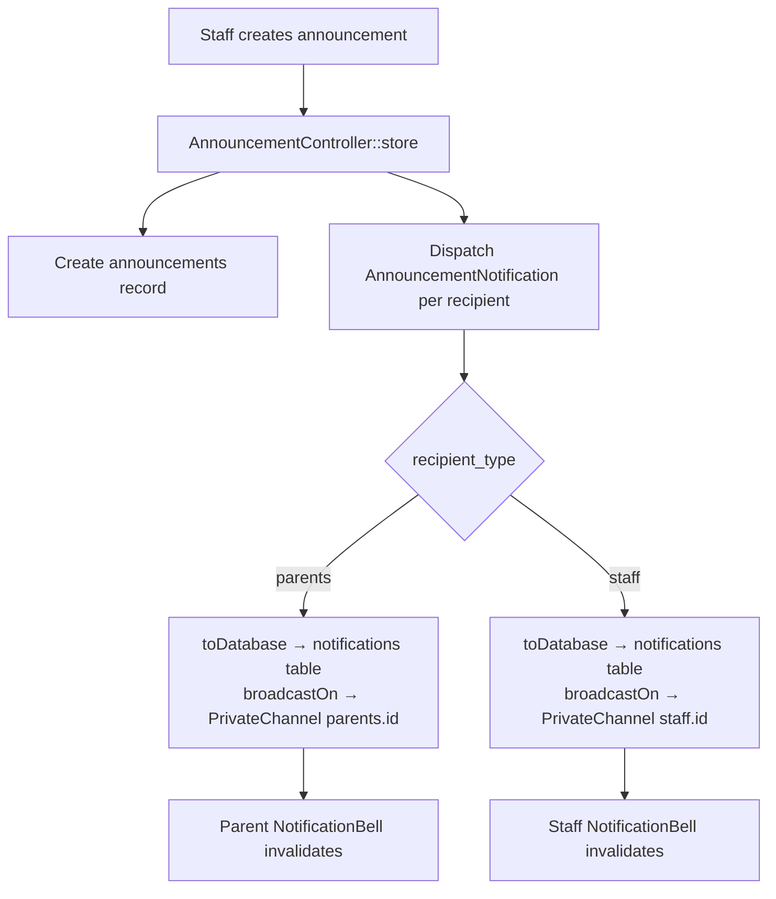

# Spec 11 — Design

## Overview

Announcements are staff-authored messages broadcast to a selected group of parents or co-workers. The feature reuses the `notifications` table from Spec 10 (polymorphic — both `ParentUser` and `User` are notifiable), adds a new `announcements` table as the parent record, and extends Reverb broadcasting to include a `staff.{userId}` private channel.

---

## Architecture



---

## Data Models

### `announcements` table (new)

```
announcements
  id
  title           (string, nullable)
  message         (text)
  sender_id       (FK → users.id)
  recipient_type  (enum: parents / staff)
  branch_id       (FK → branches.id)        ← uses HasBranch trait
  recipient_count (integer, default 0)      ← set at send time
  created_at, updated_at
```

Uses `HasBranch` trait — branch-scoped on list/show queries.

### `notifications` table (existing from Spec 10)

No changes. Both `ParentUser` and `User` write to the same table via `notifiable_type` / `notifiable_id`. The `data` JSON column stores `announcement_id` to allow fetching recipients for the detail view.

### `User` model change

Add `Notifiable` trait (one line — no migration):
```php
use Illuminate\Notifications\Notifiable;

class User extends Authenticatable
{
    use Notifiable; // ← add this
    // ...
}
```

---

## Notification Class

`App\Notifications\AnnouncementNotification` implements `ShouldQueue`, `ShouldBroadcast`:

```php
public function via(): array
{
    return ['database', 'broadcast'];
}

public function toDatabase(): array
{
    return [
        'announcement_id' => $this->announcement->id,
        'title'           => $this->announcement->title,
        'message'         => $this->announcement->message,
        'sender_name'     => $this->announcement->sender->full_name,
        'sent_at'         => $this->announcement->created_at,
    ];
}

public function broadcastOn(): array
{
    return $this->notifiable instanceof ParentUser
        ? [new PrivateChannel("parents.{$this->notifiable->id}")]
        : [new PrivateChannel("staff.{$this->notifiable->id}")];
}

public function broadcastAs(): string
{
    return 'AnnouncementNotification';
}
```

---

## Channel Authorization

Add to `routes/channels.php` (alongside the `parents.{parentId}` channel from Spec 10):

```php
Broadcast::channel('staff.{userId}', function (User $user, int $userId) {
    return $user->id === $userId;
});
```

---

## API Routes

### Kitchen API (`auth:sanctum` + ability `staff`)

| Method | Route | Roles | Description |
|---|---|---|---|
| GET | `/api/v1/announcements` | admin\|manager\|supervisor | History — branch-scoped, newest first |
| POST | `/api/v1/announcements` | admin\|manager\|supervisor | Create and send |
| GET | `/api/v1/announcements/{id}` | admin\|manager\|supervisor | Detail + recipient read status |
| GET | `/api/v1/staff/notifications/unread-count` | all staff | Bell badge count |
| GET | `/api/v1/staff/notifications` | all staff | Inbox list |
| PATCH | `/api/v1/staff/notifications/{id}/read` | all staff | Mark as read |
| DELETE | `/api/v1/staff/notifications/{id}` | all staff | Delete notification |
| POST | `/api/v1/staff/notifications/mark-all-read` | all staff | Mark all as read |

---

## POS Echo Provider

`components/providers/echo-provider.tsx` in `~/sunbites-pos` — same pattern as the portal's `EchoProvider` but reads the staff Bearer token from `useKitchenAuthStore` (or equivalent Zustand auth store):

```typescript
"use client";

const echo = new Echo({
  broadcaster: "reverb",
  key: process.env.NEXT_PUBLIC_REVERB_APP_KEY,
  wsHost: process.env.NEXT_PUBLIC_REVERB_HOST,
  wsPort: Number(process.env.NEXT_PUBLIC_REVERB_PORT ?? 443),
  forceTLS: process.env.NEXT_PUBLIC_REVERB_SCHEME === "https",
  authEndpoint: `${process.env.NEXT_PUBLIC_API_URL}/api/v1/broadcasting/auth`,
  auth: { headers: { Authorization: `Bearer ${token}` } },
});
```

The kitchen broadcast auth uses the existing `auth:sanctum` middleware — no separate route needed since `Broadcast::routes()` in `kitchen-api.php` will register at `/api/v1/broadcasting/auth`. 

> **Note**: Same `Broadcast::routes()` caveat as Spec 10 — use a manual `Route::post('/broadcasting/auth', BroadcastController::class)` inside the kitchen authenticated group to inherit the `/api/v1/` prefix.

Wrap in `app/(kitchen)/layout.tsx`:
```typescript
export default function KitchenLayout({ children }) {
  return (
    <EchoProvider>
      <KitchenLayoutShell>{children}</KitchenLayoutShell>
    </EchoProvider>
  );
}
```

---

## POS Header Layout

Two distinct bells:

```
┌──────────────────────────────────────────────────────────────┐
│  [≡] Sunbites POS          [🔔 2]  [📢 3]  [Branch ▾]       │
│                               ↑       ↑                      │
│                     Notification  Reminder                   │
│                     (inbox: msgs  (outbound:                 │
│                      received)    unsent parents)            │
└──────────────────────────────────────────────────────────────┘
```

- `NotificationBell` (🔔) — inbound; unread count of announcements received by this staff member; user-scoped
- `ReminderBell` (already in Spec 10) — outbound; count of parents not yet notified for the upcoming school month; branch-scoped

---

## POS Wireframes

### Announcements Page — `/announcements`

```
┌────────────────────────────────────────────────────┐
│ Announcements                    [+ New Announcement]│
├────────────────────────────────────────────────────┤
│ Title (if any) / Message preview     Recipients  Date│
├────────────────────────────────────────────────────┤
│ "Reminder: canteen closed tmr..."    👥 Parents  Jun 18│
│  Sent by: Maria Admin · 24 sent · 18 read              │
├────────────────────────────────────────────────────┤
│ "Staff meeting at 4pm..."            👤 Staff    Jun 15│
│  Sent by: Maria Admin · 8 sent · 5 read                │
└────────────────────────────────────────────────────┘
```

### Create Announcement — `/announcements/create`

```
┌───────────────────────────────────────────────────────────┐
│ New Announcement                                          │
│                                                           │
│ Title (optional)                                          │
│ ┌─────────────────────────────────────────────────┐      │
│ │ e.g. Canteen notice                             │      │
│ └─────────────────────────────────────────────────┘      │
│                                                           │
│ Message *                                                 │
│ ┌─────────────────────────────────────────────────┐      │
│ │                                                 │      │
│ └─────────────────────────────────────────────────┘      │
│                                                           │
│ Send to        ● Parents   ○ Staff                        │
│                                                           │
│ Recipients                      [☐ Select all (22)]      │
│ ┌─────────────────────────────────────────────────┐      │
│ │ 🔍 Search...                                    │      │
│ ├─────────────────────────────────────────────────┤      │
│ │ ☑  Maria Santos                                 │      │
│ │ ☑  Pedro Reyes                                  │      │
│ │ ☐  Clara Lim                                    │      │
│ └─────────────────────────────────────────────────┘      │
│                                                           │
│                                    [Cancel]  [Send (2)]   │
└───────────────────────────────────────────────────────────┘
```

- Toggle between Parents / Staff immediately refreshes the recipient list
- "Select all" selects all currently filtered recipients
- Send button shows selected count; disabled when 0 selected

### Announcement Detail — `/announcements/[id]`

```
┌────────────────────────────────────────────────────┐
│ ← Back to Announcements                            │
│                                                    │
│ "Reminder: canteen closed tomorrow"                │
│ Sent by Maria Admin · Jun 18, 2026 · 2:30 PM       │
│ To: Parents · 24 sent                              │
│                                                    │
│ Message:                                           │
│ The canteen will be closed tomorrow June 19...     │
│                                                    │
│ Recipients                                         │
│ ────────────────────────────────────────────────── │
│ Maria Santos         Read ✓  Jun 18, 3:01 PM       │
│ Pedro Reyes          Unread                        │
│ Clara Lim            Read ✓  Jun 18, 2:45 PM       │
└────────────────────────────────────────────────────┘
```

### Staff Notifications Inbox (POS bell dropdown or page)

Two options — either a dropdown panel from the bell or a dedicated page `/staff/notifications`. Recommend a **dedicated page** for consistency with the portal pattern.

```
┌──────────────────────────────────────────────────────────┐
│ Notifications                                            │
│                              [Mark all read] [Clear all] │
├──────────────────────────────────────────────────────────┤
│ ● Canteen notice             Jun 18 · 2:30 PM        [✕] │
│   The canteen will be closed tomorrow June 19...         │
├──────────────────────────────────────────────────────────┤
│   Staff meeting at 4pm       Jun 15 · 10:00 AM       [✕] │
│   All staff to attend the monthly review at...           │
└──────────────────────────────────────────────────────────┘
│ Empty state: No notifications yet.                        │
└──────────────────────────────────────────────────────────┘
```

Route: `app/(kitchen)/notifications/page.tsx`

---

## Dependency on Spec 10

| What Spec 11 needs | Where it comes from |
|---|---|
| `notifications` table | Spec 10 Task 1 |
| Reverb installed + `channels.php` | Spec 10 Task 2 |
| `parents.{id}` channel auth | Spec 10 Task 2 |
| Portal `EchoProvider` | Spec 10 Task 7 |

Spec 10 must be complete before Spec 11 Task 3 onwards.
