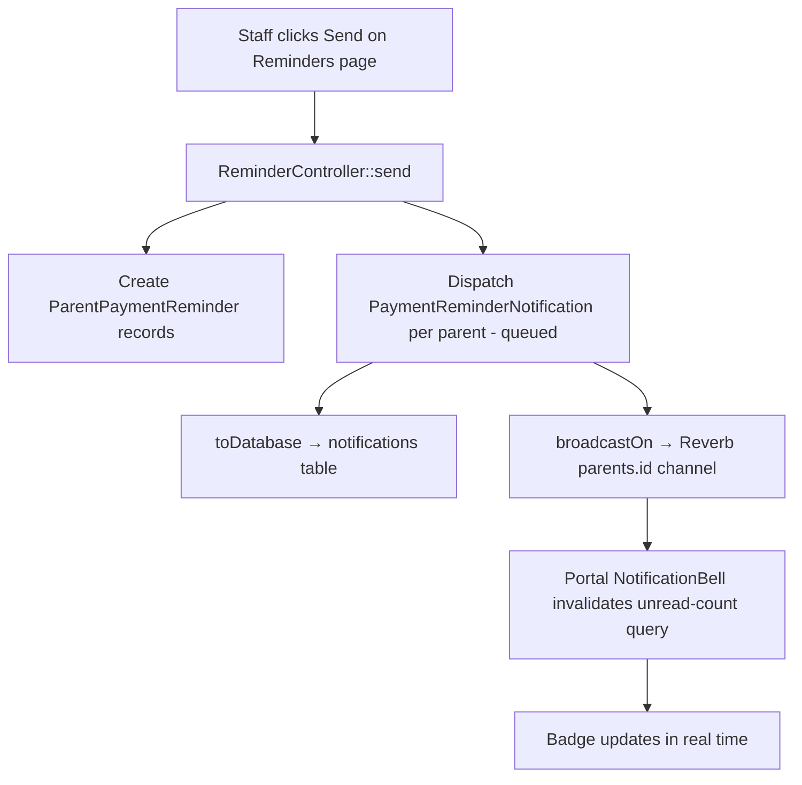

# Spec 11 — Payment Reminders Design

## Overview

The payment reminder system allows staff to manually notify parents of upcoming subscription payments. It layers on top of the notification infrastructure (Spec 10) — the `PaymentReminderNotification` class uses the existing `notifications` table and the `parents.{id}` Reverb channel.

---

## Architecture



---

## Notification Payload

`PaymentReminderNotification::toDatabase()` returns:

```json
{
  "school_month": "august",
  "school_year": 2026,
  "due_date": "2026-08-01",
  "total_amount": 4860,
  "students": [
    { "name": "Juan Santos", "amount": 2430 },
    { "name": "Ana Santos", "amount": 2430 }
  ]
}
```

**Critical rule**: `amount` per student is always read from the `StudentMonthlyPayment.amount` column for that school_month + year — never recomputed from config or `branch_monthly_amounts`. This ensures that per-branch overrides set at enrollment time are preserved in reminders.

---

## Upcoming Month Algorithm

Used by `ReminderController::bellCount()` and `eligibleParents()` to determine which school month is the current reminder target.

School months span two calendar years (June–December in year Y, January–March in year Y+1):

```php
$now = now();
$schoolYearStart = $now->month >= 6 ? $now->year : $now->year - 1;

$monthCalendarYear = [
    'june'      => $schoolYearStart,     'july'      => $schoolYearStart,
    'august'    => $schoolYearStart,     'september' => $schoolYearStart,
    'october'   => $schoolYearStart,     'november'  => $schoolYearStart,
    'december'  => $schoolYearStart,     'january'   => $schoolYearStart + 1,
    'february'  => $schoolYearStart + 1, 'march'     => $schoolYearStart + 1,
];

$paymentReminderDays = SystemConfiguration::getValue('payment_reminder_days', 14);

foreach (config('sunbites.school_months') as $key => $config) {
    $monthNumber = SchoolMonth::from($key)->toMonthNumber();
    $firstOfMonth = Carbon::create($monthCalendarYear[$key], $monthNumber, 1);
    $daysUntil = $now->diffInDays($firstOfMonth, false);

    if ($daysUntil > 0 && $daysUntil <= $paymentReminderDays) {
        $upcomingMonth = $key;
        $upcomingYear  = $monthCalendarYear[$key];
        break;
    }
}
```

The `school_year` stored in `parent_payment_reminders` is the calendar year when the month falls (August 2026 → `school_year = 2026`, January 2027 → `school_year = 2027`).

---

## POS Wireframes

### Reminders Page — `/reminders`

```
┌─────────────────────────────────────────────────────────────────┐
│ Reminders                                              [Send (2)] │
│ August 2026 · 14 days before Aug 1                              │
├────┬──────────────────────────┬─────────────────────┬───────────┤
│ ☐  │ Parent Name              │ Students            │ Status    │
├────┼──────────────────────────┼─────────────────────┼───────────┤
│ ☑  │ Maria Santos             │ Juan Santos (Gr.3)  │ Not sent  │
│ ☑  │ Pedro Reyes              │ Ana Reyes (Gr.1)    │ Not sent  │
│ ☐  │ Clara Lim                │ Leo Lim (Gr.2)      │ Sent ✓    │
└────┴──────────────────────────┴─────────────────────┴───────────┘
       [☐ Select All unsent]
```

- "Sent ✓" rows are grayed out; checkbox disabled
- "Select all" selects only unsent (enabled) rows
- Send button label shows selected count; disabled when 0 selected

### Duplicate Warning Dialog

```
┌──────────────────────────────────────────────────┐
│ Some parents already notified                    │
│                                                  │
│ Clara Lim — sent Jun 20 at 3:45 PM               │
│                                                  │
│ Send again to them as well?                      │
│              [Cancel]  [Send to all anyway]      │
└──────────────────────────────────────────────────┘
```

### Reminder Detail Page — `/reminders/[parentId]`

```
┌─────────────────────────────────────────────────┐
│ ← Back to Reminders                             │
│                                                 │
│ 👤 Maria Santos                                 │
│    maria@email.com · 09171234567                │
│    123 Rizal St, Iloilo City                    │
├─────────────────────────────────────────────────┤
│ Juan Santos · Grade 3 · Subscription            │
│                                                 │
│ Payment History                                 │
│ Month      Amount    Status   Paid Date         │
│ June 2026  ₱2,970   Paid     Jun 5, 2026        │
│ July 2026  ₱2,970   Paid     Jun 30, 2026       │
│ August 2026 ₱2,430  Unpaid   —                  │
└─────────────────────────────────────────────────┘
```

---

## Portal Payment History

Added as a tab on the student detail page in the parent portal. Visible only for subscription students.

```
┌──────────────────────────────────────────────────┐
│  Activity | Wallet | Payment History             │
│                                                  │
│  Month        Amount    Status   Paid Date       │
│  June 2025    ₱2,970    ✓ Paid   Jun 5, 2026     │
│  July 2025    ₱2,970    ✗ Unpaid —               │
│  August 2025  ₱2,430    ✗ Unpaid —               │
└──────────────────────────────────────────────────┘
```

Non-subscription students: tab is not rendered.

---

## Security Notes

- `ReminderController::send()` enforces role `admin|manager` — Supervisors can view but not send.
- `StudentPaymentHistoryController` validates the parent owns the student via `parent_student` pivot before returning any data.
- Non-subscription students are excluded from all reminder queries and from the payment history endpoint (returns empty array).
- Reminder window is computed server-side — clients cannot manipulate which month is targeted.
