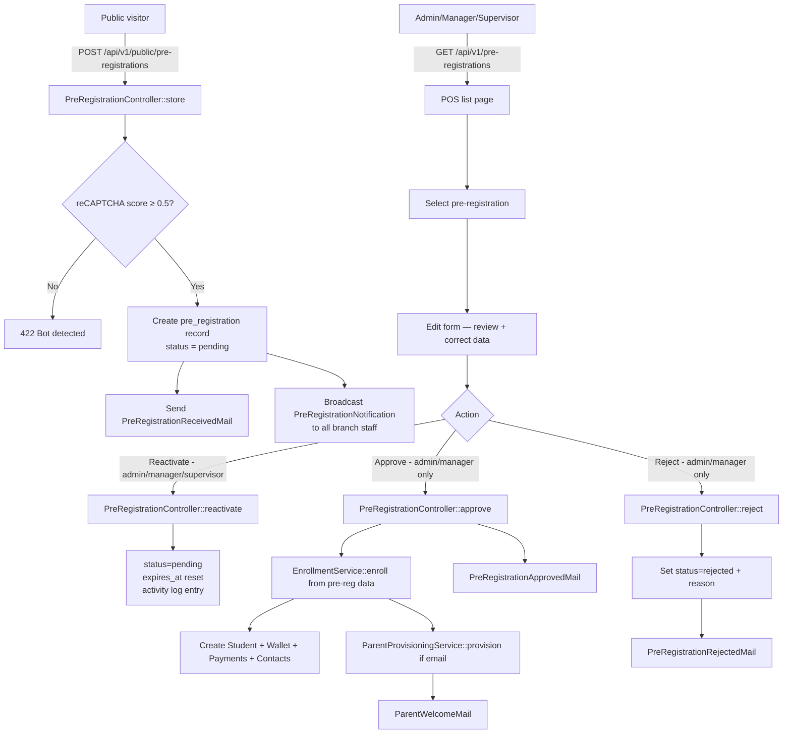

# Spec 12 — Design

## Overview

Pre-Registration adds a public form on the portal domain, a staff-facing processing queue in the POS, and an approval flow that delegates to the existing enrollment business logic. The feature is self-contained — pre-registration data lives in its own tables until approval converts it into a real student record.

---

## Architecture



---

## Data Models

### `pre_registrations` table

```
pre_registrations
  id
  branch_id                   (FK → branches.id)

  -- Student info
  first_name                  (string)
  last_name                   (string)
  student_number              (string, nullable)
  grade_level                 (string)
  section                     (string, nullable)
  birthday                    (date)
  allergies                   (text, nullable)
  notes                       (text, nullable)
  enrollment_type             (enum: subscription / non_subscription)

  -- Subscription period (nullable, subscription type only)
  subscription_start_month    (string, nullable)
  subscription_start_year     (integer, nullable)
  subscription_end_month      (string, nullable)
  subscription_end_year       (integer, nullable)

  -- Acknowledgement
  signatory_name              (string)
  acknowledged_at             (timestamp)

  -- Status & processing
  status                      (enum: pending / approved / rejected / expired)
  approved_by                 (FK → users.id, nullable)
  rejected_by                 (FK → users.id, nullable)
  rejection_reason            (text, nullable)
  processed_at                (timestamp, nullable)

  -- Security
  recaptcha_score             (decimal 3,2, nullable)
  submitter_ip                (string, nullable)

  -- Expiry
  expires_at                  (timestamp)

  created_at, updated_at
```

### `pre_registration_contacts` table

```
pre_registration_contacts
  id
  pre_registration_id   (FK → pre_registrations.id, cascade delete)
  full_name             (string)
  relationship          (string)
  phone                 (string)
  email                 (string, nullable)
  address               (string)
  is_primary            (bool, default false)
  created_at, updated_at
```

### System Configuration Addition

Add to `SystemConfigurationSeeder`:

| Key | Value | Type | Label |
|---|---|---|---|
| `pre_registration_expiry_days` | `30` | `integer` | Pre-Registration Expiry Days |

---

## Google reCAPTCHA v3 Setup

### Registration (one-time, 5 minutes)

1. Go to [https://www.google.com/recaptcha/admin/create](https://www.google.com/recaptcha/admin/create)
2. Fill in:
   - **Label**: Sunbites Portal Pre-Registration
   - **reCAPTCHA type**: Score based (v3)
   - **Domains**: Add all of these:
     - `localhost`
     - `portal.sunbites.com.ph`
     - `127.0.0.1`
3. Accept terms → **Submit**
4. You receive two keys:
   - **Site key** (public) → `NEXT_PUBLIC_RECAPTCHA_SITE_KEY` in portal `.env.local`
   - **Secret key** (private) → `RECAPTCHA_SECRET_KEY` in Laravel `.env`

### Laravel — Backend Verification

Add to `config/services.php`:
```php
'recaptcha' => [
    'secret' => env('RECAPTCHA_SECRET_KEY'),
    'threshold' => env('RECAPTCHA_THRESHOLD', 0.5),
],
```

Verify in `PreRegistrationController::store()`:
```php
$response = Http::asForm()->post('https://www.google.com/recaptcha/api/siteverify', [
    'secret'   => config('services.recaptcha.secret'),
    'response' => $request->input('recaptcha_token'),
    'remoteip' => $request->ip(),
]);

$data = $response->json();

if (! ($data['success'] ?? false) || ($data['score'] ?? 0) < config('services.recaptcha.threshold')) {
    return response()->json(['message' => 'Submission could not be verified. Please try again.'], 422);
}

// Store score for audit
$recaptchaScore = $data['score'] ?? null;
```

### Next.js Portal — Frontend Integration

```bash
npm install react-google-recaptcha-v3
```

Wrap the page in `app/(public)/pre-register/page.tsx`:
```typescript
// app/(public)/pre-register/layout.tsx
import { GoogleReCaptchaProvider } from "react-google-recaptcha-v3";

export default function PreRegisterLayout({ children }) {
  return (
    <GoogleReCaptchaProvider reCaptchaKey={process.env.NEXT_PUBLIC_RECAPTCHA_SITE_KEY!}>
      {children}
    </GoogleReCaptchaProvider>
  );
}
```

In the form component (Client Component):
```typescript
"use client";
import { useGoogleReCaptcha } from "react-google-recaptcha-v3";

export function PreRegistrationForm() {
  const { executeRecaptcha } = useGoogleReCaptcha();

  const handleSubmit = async (formData) => {
    const token = await executeRecaptcha("pre_registration");
    await preRegistrationApi.submit({ ...formData, recaptcha_token: token });
  };
}
```

---

## API Routes

### Public (no auth)

| Method | Route | Description |
|---|---|---|
| GET | `/api/v1/public/branches` | List branches where `is_active = true` (id + name only) |
| POST | `/api/v1/public/pre-registrations` | Submit pre-registration; rate limited 3/hr per IP; reCAPTCHA required |

### Kitchen API (`auth:sanctum` + ability `staff`)

| Method | Route | Roles | Description |
|---|---|---|---|
| GET | `/api/v1/pre-registrations` | admin\|manager\|supervisor | List; branch-scoped; default filter: pending |
| GET | `/api/v1/pre-registrations/{id}` | admin\|manager\|supervisor | Detail with duplicate warning if applicable |
| PATCH | `/api/v1/pre-registrations/{id}` | admin\|manager\|supervisor | Edit pending pre-registration |
| POST | `/api/v1/pre-registrations/{id}/approve` | admin\|manager | Approve → enroll |
| POST | `/api/v1/pre-registrations/{id}/reject` | admin\|manager | Reject with reason |
| POST | `/api/v1/pre-registrations/{id}/reactivate` | admin\|manager\|supervisor | Reactivate expired → pending; resets expires_at |

---

## Mail Classes

| Class | Recipient | Trigger |
|---|---|---|
| `PreRegistrationReceivedMail` | Primary contact email | On successful submission |
| `PreRegistrationApprovedMail` | Primary contact email | On approval (before `ParentWelcomeMail`) |
| `PreRegistrationRejectedMail` | Primary contact email | On rejection; includes `rejection_reason` |

All three are queued (`ShouldQueue`). If no primary contact email, mail is skipped silently.

---

## Staff Notification on New Submission

On successful pre-registration submission, dispatch `PreRegistrationNotification` (database + broadcast) to every `User` assigned to the selected branch:

```php
$branch->users->each(function (User $staff) use ($preRegistration) {
    $staff->notify(new PreRegistrationNotification($preRegistration));
});
```

Channel: `PrivateChannel("staff.{$staff->id}")` — same infrastructure as Spec 11.

Staff POS notification bell count increases. Clicking the notification navigates to `/pre-registrations/{id}`.

---

## Expiry Scheduled Command

`App\Console\Commands\ExpirePreRegistrations`:

```php
PreRegistration::where('status', 'pending')
    ->where('expires_at', '<', now())
    ->update(['status' => 'expired']);
```

Scheduled daily in `routes/console.php`:
```php
Schedule::command('pre-registrations:expire')->daily();
```

---

## Approval Flow Detail

`PreRegistrationController::approve()` must not duplicate enrollment logic. Introduce `App\Services\EnrollmentService` (extract from `EnrollmentController`) if not already extracted, and call it with the pre-registration data:

```php
// Pseudocode
DB::transaction(function () use ($preReg) {
    $student = EnrollmentService::enroll([
        'branch_id'      => $preReg->branch_id,
        'first_name'     => $preReg->first_name,
        // ... all student fields
        'enrollment_type' => $preReg->enrollment_type,
        'subscription_start_month' => $preReg->subscription_start_month,
        // ...
    ]);

    foreach ($preReg->contacts as $contact) {
        StudentContact::create([...$contact->toArray(), 'student_id' => $student->id]);

        if ($contact->is_primary && $contact->email) {
            ParentProvisioningService::provision(
                email: $contact->email,
                name: $contact->full_name,
                studentId: $student->id,
                enrolledBy: auth()->id()
            );
        }
    }

    $preReg->update([
        'status'       => 'approved',
        'approved_by'  => auth()->id(),
        'processed_at' => now(),
    ]);
});
```

---

## Portal Public Page Wireframes

### Pre-Registration Form — `portal.sunbites.com.ph/pre-register`

```
┌─────────────────────────────────────────────────────────┐
│  🍅 Sunbites Kitchen                                    │
│                                                         │
│  Student Pre-Registration                               │
│  Fill out this form and our staff will contact you.     │
│                                                         │
│  BRANCH                                                 │
│  ┌──────────────┐  ┌──────────────┐                    │
│  │ ● Iloilo     │  │ ○ Bacolod    │                    │
│  └──────────────┘  └──────────────┘                    │
│                                                         │
│  ENROLLMENT TYPE                                        │
│  ┌────────────────────┐  ┌───────────────────┐         │
│  │ Subscription       │  │ Non-Subscription  │         │
│  │ Monthly fee-based  │  │ Wallet purchases  │         │
│  └────────────────────┘  └───────────────────┘         │
│                                                         │
│  STUDENT INFORMATION                                    │
│  [First Name *]        [Last Name *]                    │
│  [Student Number]      [Grade Level * ▾]                │
│  [Section]             [Birthday *]                     │
│  [Allergies]                                            │
│  [Notes]                                               │
│                                                         │
│  SUBSCRIPTION PERIOD (shown if Subscription selected)  │
│  Start: [Month ▾] [Year]  End: [Month ▾] [Year]        │
│                                                         │
│  PARENT / GUARDIAN                                      │
│  PRIMARY CONTACT                                        │
│  [Full Name *]         [Relationship * ▾]               │
│  [Phone *]             [Email]                          │
│  [Address *]                                            │
│  + Add Another Contact                                  │
│                                                         │
│  PERMISSIONS & ACKNOWLEDGEMENT                          │
│  ☐ I agree — The monthly subscription fee...           │
│  ☐ I agree — Sunbites Kitchen will continue...         │
│  [Signature *]         [Date — auto-filled]             │
│                                                         │
│  🔒 Protected by reCAPTCHA                             │
│                                    [Submit Pre-Registration] │
└─────────────────────────────────────────────────────────┘
```

### Success State (replaces form after submit)

```
┌─────────────────────────────────────────────────────────┐
│  ✅ Pre-Registration Received                           │
│                                                         │
│  Thank you, [Signatory Name]!                          │
│                                                         │
│  We've received the pre-registration for               │
│  [Student First Name]. Our staff will review your      │
│  submission and contact you shortly.                    │
│                                                         │
│  A confirmation has been sent to [email] (if provided). │
│                                                         │
│  [Submit Another Pre-Registration]                      │
└─────────────────────────────────────────────────────────┘
```

---

## POS Wireframes

### Pre-Registrations List — `/pre-registrations`

```
┌──────────────────────────────────────────────────────────────────┐
│ Pre-Registrations                                                │
│ [Pending ▾]  🔍 Search...                                        │
├──────────┬────────────────┬────────────┬───────────┬────────────┤
│ Student  │ Contact        │ Type       │ Submitted │ Expires    │
├──────────┼────────────────┼────────────┼───────────┼────────────┤
│ Juan S.  │ Maria Santos   │ Sub        │ Jun 18    │ Jul 18     │
│ Ana R.   │ Pedro Reyes    │ Non-sub    │ Jun 17    │ Jul 17     │
└──────────┴────────────────┴────────────┴───────────┴────────────┘
```

### Pre-Registration Detail / Edit — `/pre-registrations/[id]`

```
┌──────────────────────────────────────────────────────────────────┐
│ ← Back    Pre-Registration — Juan Santos       [Pending]        │
│                                                                  │
│  ⚠ Duplicate warning: Student number "2024-001" already         │
│    exists in this branch (Ana Reyes). Please verify.            │
│                                                                  │
│  [All enrollment fields — editable form]                        │
│                                                                  │
│  Submitted: Jun 18, 2026 · Expires: Jul 18, 2026               │
│  reCAPTCHA score: 0.9                                            │
│                                                                  │
│           [Save Changes]  [Reject ▾]  [Approve & Enroll]        │
│           (all roles)   (admin|mgr)   (admin|mgr only)          │
└──────────────────────────────────────────────────────────────────┘
```

### Reject Dialog

```
┌──────────────────────────────────────┐
│ Reject Pre-Registration              │
│                                      │
│ Reason for rejection *               │
│ ┌──────────────────────────────────┐ │
│ │                                  │ │
│ └──────────────────────────────────┘ │
│ The parent will be notified by email.│
│                                      │
│       [Cancel]  [Confirm Rejection]  │
└──────────────────────────────────────┘
```

---

## Dependencies

| What Spec 12 needs | Source |
|---|---|
| `notifications` table + Reverb + `staff.{id}` channel | Spec 10 + 11 |
| `ParentProvisioningService` | Spec 07 |
| Enrollment business logic (`EnrollmentService`) | Spec 05 (extract to service) |
| `pre_registration_expiry_days` system config | Spec 09 seeder extension |
| Staff notification bell (inbound) | Spec 11 |
