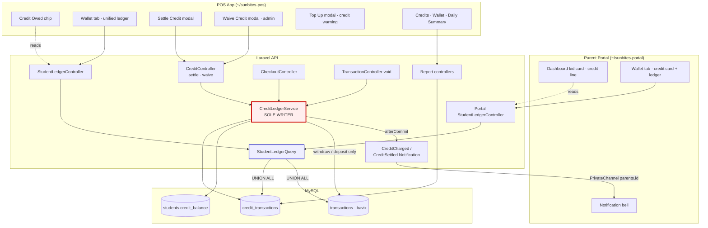
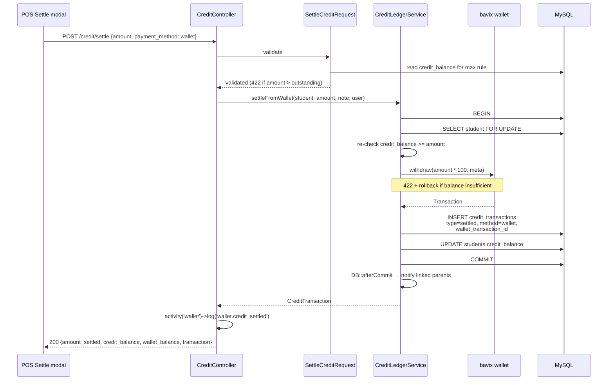

# Spec 14 — Credit Settlement · Design

## Overview

The existing credit implementation treats `students.credit_balance` as a number to be edited and `credit_transactions` as a log written alongside it. Three separate call sites do this today — checkout, void, and settle — each with slightly different arithmetic. That is why the balance and the ledger can disagree, and why settlement records nothing about the money collected.

This design makes three structural changes and then layers features on top of them:

1. **`CreditLedgerService` becomes the only writer** of the credit ledger and `credit_balance`. Checkout, void, settle, and waive all route through it. The invariant `credit_balance = Σcharged − Σsettled − Σwaived − Σvoided` becomes a property of the code rather than a coincidence.
2. **`credit_transactions` gains the columns a payment event needs** — `payment_method`, `reference_number`, `wallet_transaction_id`, `branch_id` — plus a `waived` type distinct from `settled`.
3. **A single `StudentLedgerQuery`** merges wallet and credit entries into one paginated stream, replacing three divergent history readers with one contract used by both apps.

Everything else — the POS chip, the settle modal, the portal card, the report columns — reads from those three.

### Key decisions and rationale

| Decision | Rationale |
|---|---|
| Credit stays a separate ledger, not a negative wallet balance | A negative wallet would make "how much is owed" a sign check, destroy the existing `credit_transactions` audit trail and credit report, and blur prepaid float against receivables. The migration risk far exceeds the benefit. |
| Top-up never settles credit | Keeps the wallet ledger and credit ledger independently auditable. A parent topping up ₱500 for next week should not have it consumed by an old debt without a staff decision. |
| `waived` is its own type | If a write-off were `settled` with a note, the credit report's settled total would blend money collected with money forgiven — and that total feeds cash reconciliation. |
| `payment_method = wallet` rather than a separate endpoint | A wallet-funded settlement is the same ledger event with a different funding source. One endpoint, one validation path, one reporting shape. |
| `UNION ALL` at the database level, not a PHP merge | The portal exposes an "All time" filter. An in-memory merge is unbounded by design. |
| Form Requests for the new endpoints | `tech.md` declares Form Requests as the standard. See the drift note below. |
| Settlements excluded from `total_revenue` | The revenue was booked on the original order date. Counting the settlement again double-counts it. |

### Steering conformance and drift

Verified against the codebase, not assumed:

- **Drift, now resolved:** [`tech.md`](../../steering/tech.md) declared *"Form Request classes for validation — never inline `$request->validate()`"* while 47 files under `app/Http/Controllers/` validate inline and `app/Http/Requests/` held only a `Public/` subdirectory. Steering has been amended (approved) to state the rule as forward-looking. This design uses Form Requests for new code (`SettleCreditRequest`, `WaiveCreditRequest`) and leaves the 47 legacy call sites alone. The new controllers will therefore not match their siblings' shape — a deliberate inconsistency in the direction steering points.
- **Drift, now resolved:** [`product.md`](../../steering/product.md) described Supervisor as "no mutations" and Cashier as "POS checkout only". The Supervisor line was already false — [`routes/kitchen-api.php:142-167`](../../../routes/kitchen-api.php#L142-L167) grants supervisors student edits, soft deletes, QR regeneration, and wallet top-up. Both descriptions have been amended (approved). Cashiers were verified excluded from the top-up group, so they gain credit settlement only.
- **Drift, now resolved:** [`structure.md`](../../steering/structure.md) listed a `hooks/` directory for `~/sunbites-portal` that does not exist; all 12 portal query call sites define `useQuery` inline. The line has been removed (approved). The POS `hooks/` entry stays — that directory is real, and task 7.1 uses it.
- **Conforms:** wallet mutations go only through the `bavix/laravel-wallet` API. Branch context read only via `app('active_branch')`. Kitchen and Portal namespaces stay separate. Notifications broadcast on `parents.{id}` private channels. Activity logging via `spatie/laravel-activitylog`.

### Ground truth verification

These were executed against the running Sail environment, not inferred. Treat them as settled.

| Claim | How it was verified | Result |
|---|---|---|
`transactions.deleted_at` exists | `migrate` on an empty DB, then `SHOW COLUMNS FROM transactions` | Present. Added by `vendor/bavix/laravel-wallet/database/2023_12_30_204610_soft_delete.php`, not by the published migration |
`transactions.amount` is signed minor units, `decimal(64,0)` | `SHOW COLUMNS FROM transactions` | Confirmed. `ABS(amount) / 100` is the correct conversion |
`UNION ALL` + `fromSub` + `whereIn` + `whereDate` + `paginate()` works | Built the exact query in tinker, inspected SQL and bindings, ran `paginate(3)` | Works. Bindings resolve in correct order: `[wallet_id, confirmed, student_id, …filters]`. The `count(*)` aggregate `paginate()` issues also succeeds |
`notifications.data` column type | `SHOW COLUMNS FROM notifications` | **`text`**, not `json` — see the debounce note under Notifications |
POS consumes `wallet_transactions` | grep across `~/sunbites-pos` | Three touch points, listed under *Contract removed* |
`credit_transactions` currently lacks `payment_method` | The tinker union query failed on it before the migration exists | Confirmed; the failure is expected and resolves with task 1.2 |
bavix version | `composer.lock` | 12.0.3 |

The local `laravel` database was empty (0 tables) before this verification; `migrate` was run against it. No production or staging data was touched.

### In-flight spec overlap

All 13 registered specs are Complete, so there is no concurrent work to collide with. This design modifies surfaces owned by four of them: **05** (student detail, wallet top-up), **06** (checkout credit charge, order void), **07** (portal student detail, wallet view), **08** (credit report, wallet report, daily summary). Each modification is additive except Requirement 6.11, which removes `wallet_transactions` from the Spec 05 student show payload.

---

## Architecture



The red node is the architectural constraint that matters: nothing outside `CreditLedgerService` writes credit state.

### Settle-from-wallet data flow

The only channel that touches both ledgers in one operation:



The wallet withdrawal and the ledger insert share one transaction. If either fails, neither happened — the wallet can never be debited without the debt being reduced, and vice versa.

---

## Components and Interfaces

### `App\Services\CreditLedgerService` (new)

The domain core. Follows the existing `app/Services/` convention (`EnrollmentService`, `ParentProvisioningService`).

```php
final class CreditLedgerService
{
    public function charge(Student $student, float $amount, string $receiptNumber, User $performer): CreditTransaction;

    public function settleWithPayment(
        Student $student,
        float $amount,
        CreditSettlementMethod $method,
        ?string $referenceNumber,
        ?string $note,
        User $performer,
    ): CreditTransaction;

    public function settleFromWallet(Student $student, float $amount, ?string $note, User $performer): CreditTransaction;

    public function waive(Student $student, float $amount, string $reason, User $performer): CreditTransaction;

    public function void(Student $student, Order $order, User $performer): CreditTransaction;
}
```

**Invariants enforced by every method:**

- All writes inside `DB::transaction`. When called from within an existing transaction (`CheckoutController`, `TransactionController::void`), Laravel nests via savepoint — correct behaviour, no special casing needed.
- `Student::lockForUpdate()->findOrFail($student->id)` before reading `credit_balance`. Re-locking a student already locked by the outer transaction is a no-op on the same connection.
- `credit_balance` is recomputed as `max(0, …)`-free arithmetic; a result below zero aborts with 422 rather than clamping. The current [`TransactionController::void`](../../../app/Http/Controllers/Kitchen/TransactionController.php) clamps with `max(0, …)`, which silently absorbs ledger inconsistency — routing void through the service removes that.
- Every row sets `branch_id`, `performed_by`, and an explicit `created_at` (the model has `$timestamps = false`).

**Not the service's job:** activity logging and HTTP concerns stay in controllers, matching how [`CreditController`](../../../app/Http/Controllers/Kitchen/CreditController.php) already separates them.

#### Why `charge()` takes a receipt number, not an `Order`

`charge()` **cannot** accept an `Order`. In [`CheckoutController`](../../../app/Http/Controllers/Kitchen/CheckoutController.php) the sequence inside the transaction is:

```
line 160   $receiptNumber = Order::generateReceiptNumber(...)
line 172   CreditTransaction::create([...])          ← credit charged here
line 184   $student->withdraw(...)                   ← wallet drained
line 196   $order = Order::create([...])             ← order created AFTER
```

The order does not exist when credit is charged, which is why existing `charged` rows have a **null `order_id`** and carry the receipt number in `notes` instead. `charge()` therefore takes `string $receiptNumber` and writes `order_id = null`, preserving current behaviour exactly.

Do **not** "fix" this by reordering checkout to create the order first. `Order::create()` requires `is_credit` and `credit_amount`, which are only known after the credit decision, so the reorder is not a simple move — it would need the credit amount computed, the order created, then the ledger written, splitting one cohesive block into three. That is a behaviour-affecting refactor of the checkout hot path and is explicitly out of scope. `void()` does not need the charge row's `order_id` — it reads `credit_amount` off the order itself.

### `App\Services\StudentLedgerQuery` (new)

Returns a query builder, not results — so callers control pagination and both apps share one definition.

```php
final class StudentLedgerQuery
{
    /** @param 'all'|'topup'|'purchase'|'credit' $entryFilter */
    public function for(
        Student $student,
        string $entryFilter = 'all',
        ?string $from = null,
        ?string $to = null,
    ): \Illuminate\Database\Query\Builder;
}
```

Implementation shape:

```php
$wallet = DB::table('transactions')
    ->selectRaw("
        CONCAT('wallet-', id) AS row_id,
        created_at,
        type AS entry_type,
        ABS(amount) / 100.0 AS amount,
        meta AS details,
        NULL AS payment_method,
        NULL AS reference_number,
        NULL AS order_id,
        NULL AS performed_by
    ")
    ->where('wallet_id', $student->wallet->id)
    ->where('confirmed', true)
    ->whereNull('deleted_at');

$credit = DB::table('credit_transactions')
    ->selectRaw("
        CONCAT('credit-', id) AS row_id,
        created_at,
        CONCAT('credit_', type) AS entry_type,
        amount,
        notes AS details,
        payment_method,
        reference_number,
        order_id,
        performed_by
    ")
    ->where('student_id', $student->id);

return DB::query()
    ->fromSub($wallet->unionAll($credit), 'ledger')
    ->orderByDesc('created_at');
```

Notes on correctness:

- `ABS(amount) / 100.0` — `bavix` stores minor units and signs withdrawals negative. Sign is carried by `direction`, not by the amount.
- **The `.0` is mandatory, not cosmetic.** Tests run on **SQLite** while production runs **MySQL** (`phpunit.xml` sets `DB_DATABASE=testing`). SQLite performs *integer* division on two integers: `2550 / 100` yields `25`, silently destroying ₱0.50. `2550 / 100.0` yields `25.5`. MySQL returns a decimal either way, so writing `/ 100` produces code that is correct in production and silently wrong in every test. [`WalletReportController`](../../../app/Http/Controllers/Kitchen/WalletReportController.php) already uses `/ 100.0` for this reason.
- `confirmed = true` and `deleted_at IS NULL` are applied here. The current [`StudentController::show`](../../../app/Http/Controllers/Kitchen/StudentController.php) applies neither, so unconfirmed and soft-deleted wallet rows can leak into the POS table today. The ledger fixes that.
- **`deleted_at` does exist on `transactions`, despite not appearing in [`database/migrations/2018_11_06_222923_create_transactions_table.php`](../../../database/migrations/2018_11_06_222923_create_transactions_table.php).** It is added by the package migration `vendor/bavix/laravel-wallet/database/2023_12_30_204610_soft_delete.php`, and `Bavix\Wallet\Models\Transaction` uses the `SoftDeletes` trait. Verified by running `migrate` on an empty database and inspecting the resulting table. Do not "fix" the missing column by adding a migration for it — that would collide with the package migration.
- A student with no wallet yet yields the credit leg only; the wallet leg is skipped rather than joining on a null id.
- `entryFilter` maps to `whereIn` on `entry_type`: `topup → ['deposit']`, `purchase → ['withdraw']`, `credit → ['credit_charged','credit_settled','credit_waived','credit_voided']`.

### `App\Services\LedgerEntryFormatter` (new)

Formats raw union rows into the API contract. `entry_label` and `direction` are derived server-side so both frontends stay dumb.

**Deliberately not a `JsonResource`.** The rows are `stdClass` from a union subquery, not Eloquent models, and formatting needs a batched performer-name map that a `JsonResource` cannot receive — `JsonResource::collection()` passes only the row, and `->additional()` would place the map outside `data`. The codebase precedent is to map inline with a closure that closes over the map: see [`CreditReportController`](../../../app/Http/Controllers/Kitchen/CreditReportController.php) and [`WalletHistoryController`](../../../app/Http/Controllers/Kitchen/WalletHistoryController.php). This class makes that reusable across the Kitchen and Portal controllers.

```php
final class LedgerEntryFormatter
{
    /**
     * @param  \Illuminate\Support\Collection<int, object>  $rows
     * @return \Illuminate\Support\Collection<int, array<string, mixed>>
     */
    public function format(Collection $rows): Collection
    {
        $names = $this->resolvePerformerNames($rows);

        return $rows->map(fn (object $row) => [
            'id'               => $row->row_id,
            'date'             => Carbon::parse($row->created_at)->toIso8601String(),
            'entry_type'       => $row->entry_type,
            'entry_label'      => LedgerEntryType::from($row->entry_type)->label(),
            'direction'        => LedgerEntryType::from($row->entry_type)->direction(),
            'amount'           => round((float) $row->amount, 2),
            'payment_method'   => $row->payment_method,
            'reference_number' => $row->reference_number,
            'note'             => $this->resolveNote($row),
            'performed_by'     => $names[$this->performerId($row)] ?? null,
        ]);
    }
}
```

`resolveNote()` for wallet rows decodes the `meta` JSON, preferring `note`, then `source`, then `payment_method` — the keys [`WalletController::topUp`](../../../app/Http/Controllers/Kitchen/WalletController.php) and [`InlineReloadController`](../../../app/Http/Controllers/Kitchen/InlineReloadController.php) actually write. For credit rows it returns `details` (the aliased `notes`) directly.

`performerId()` reads `performed_by` for credit rows, and `meta.performed_by` then `meta.cashier_id` for wallet rows — again matching what the two top-up paths write. `resolvePerformerNames()` collects every id and issues one `User::whereIn('id', …)`, the same batching already used in [`WalletHistoryController`](../../../app/Http/Controllers/Kitchen/WalletHistoryController.php).

### `App\Enums\LedgerEntryType` (new)

Backed enum carrying the label and direction, so the six-way mapping lives in one place rather than in two frontends.

```php
enum LedgerEntryType: string
{
    case Deposit       = 'deposit';
    case Withdraw      = 'withdraw';
    case CreditCharged = 'credit_charged';
    case CreditSettled = 'credit_settled';
    case CreditWaived  = 'credit_waived';
    case CreditVoided  = 'credit_voided';

    public function label(): string;      // 'Top-up', 'Purchase', 'Credit Charged', …
    public function direction(): string;  // 'credit' | 'debit'
}
```

### `App\Http\Requests\SettleCreditRequest` (new)

```php
public function rules(): array
{
    /** @var Student $student */
    $student = $this->route('student');

    return [
        'amount' => [
            'required', 'numeric', 'min:0.01',
            $this->notExceedingOutstandingCredit($student),
        ],
        'payment_method'   => ['required', Rule::enum(CreditSettlementMethod::class)],
        'reference_number' => [
            'nullable', 'required_if:payment_method,gcash,bank_transfer',
            'alpha_num', 'max:50',
        ],
        'note' => ['nullable', 'string', 'max:255'],
    ];
}
```

`notExceedingOutstandingCredit()` returns a closure rule so the message names the figure: *"Amount exceeds outstanding credit of ₱150.00."*

It is a **closure rule shared via a trait** (`app/Http/Requests/Concerns/ValidatesOutstandingCredit.php`) rather than a `Rule` class, because `app/Rules/` does not exist in this project and `CLAUDE.md` forbids creating new base directories without approval. `app/Http/Requests/` already has subdirectories (`Public/`), so `Concerns/` follows existing precedent.

The rule reads the balance for validation only; `CreditLedgerService` re-checks it under `lockForUpdate`, because validation is not a transaction boundary.

### `App\Http\Requests\WaiveCreditRequest` (new)

```php
'amount' => ['required', 'numeric', 'min:0.01', $this->notExceedingOutstandingCredit($student)],
'reason' => ['required', 'string', 'min:5', 'max:1000'],
```

Uses the same `ValidatesOutstandingCredit` trait.

Authorization is route middleware (`role:admin`), not `authorize()` in the request — consistent with how the rest of `kitchen-api.php` gates roles.

### `App\Http\Controllers\Kitchen\CreditController` (rewritten)

```php
public function settle(SettleCreditRequest $request, Student $student): JsonResponse;
public function waive(WaiveCreditRequest $request, Student $student): JsonResponse;
```

`settle()` dispatches to `settleFromWallet()` when `payment_method === wallet`, otherwise `settleWithPayment()`. Both branches then write the activity log and return the same response shape. The existing `credit_balance <= 0` pre-check and its 422 message are retained.

### `App\Http\Controllers\Kitchen\StudentLedgerController` (new)

Single `index(Request $request, Student $student)`. Validates `entry_type`, `from`, `to`, `per_page`, calls `StudentLedgerQuery`, paginates, then passes `$paginator->getCollection()` through `LedgerEntryFormatter::format()` and returns `{ data, meta }` using the base controller's `paginationMeta()`.

### `App\Http\Controllers\Portal\StudentLedgerController` (new)

Identical shape, plus `$this->authorize('view', $student)` — the guard already used by [`Portal\WalletController`](../../../app/Http/Controllers/Portal/WalletController.php). Kept as a separate class because `structure.md` forbids Kitchen and Portal controllers importing each other; the shared logic lives in `StudentLedgerQuery`.

### Notifications (new)

`CreditChargedNotification` and `CreditSettledNotification`, modelled directly on [`PaymentReminderNotification`](../../../app/Notifications/PaymentReminderNotification.php):

```php
class CreditSettledNotification extends Notification implements ShouldBroadcast, ShouldQueue
{
    use Queueable;

    // Assigned in the constructor body — NOT declared as a property. See note below.

    public function __construct(
        public readonly Student $student,
        public readonly float $amount,
        public readonly float $outstandingAfter,
        public readonly bool $wasWaived = false,
    ) {}

    public function via(object $notifiable): array { return ['database', 'broadcast']; }
    public function broadcastOn(): array { return [new PrivateChannel("parents.{$notifiable->id}")]; }
}
```

`$afterCommit = true` is how criterion 9.6 is satisfied — Laravel holds the queued notification until the outermost transaction commits, which handles the nested-transaction case when `charge()` runs inside `CheckoutController`'s transaction. No manual `DB::afterCommit` wrapping needed.

**Assign it in the constructor body; never declare it as a property.** `Illuminate\Bus\Queueable` already declares `public $afterCommit;` with **no default value**, and PHP rejects any redeclaration whose definition differs — including one that merely adds a default, and regardless of type hint. The result is a hard fatal at class-composition time:

```
App\Notifications\CreditChargedNotification and Illuminate\Bus\Queueable define the same
property ($afterCommit) in the composition of ... However, the definition differs and is
considered incompatible.
```

Under PHPUnit this surfaces only as `Fatal error: Premature end of PHP process`, with no stack trace pointing at the cause. Correct form:

```php
public function __construct(/* promoted properties */) {
    $this->afterCommit = true;
}
```

**Debounce for `CreditChargedNotification`** (criterion 9.2), checked per parent before dispatch:

```php
$alreadySentToday = $parent->notifications()
    ->where('type', CreditChargedNotification::class)
    ->whereDate('created_at', now()->toDateString())
    ->get()
    ->contains(fn ($n) => (int) ($n->data['student_id'] ?? 0) === $student->id);
```

**Do not use `->where('data->student_id', $student->id)`.** Verified against the live schema: `notifications.data` is a **`text`** column, not `json`. Laravel compiles the `->` operator to `json_extract(data, '$.student_id')`, and comparing a `json_extract` result against an integer binding on a TEXT column has fragile type-coercion semantics in MySQL. Filtering by `type` and date in SQL then matching `student_id` in PHP is robust and cheap — the candidate set is one parent's charge notifications for a single day, which is at most a handful of rows.

This requires `student_id` in the notification payload, which criterion 9.5 already mandates. `$n->data` is already cast to an array by `DatabaseNotification`.

### Report controller changes

| Controller | Change |
|---|---|
[`CreditReportController`](../../../app/Http/Controllers/Kitchen/CreditReportController.php) | Branch filter switches from `whereIn(studentIds)` to `where('branch_id', $branchId)`. Adds `total_waived`, corrects `net_outstanding` to subtract waived, adds `settled_by_method` grouping, adds `payment_method` filter, adds `payment_method` and `reference_number` to rows. `performed_by` stays a plain string — the POS is corrected instead. |
[`WalletReportController`](../../../app/Http/Controllers/Kitchen/WalletReportController.php) | `summary` gains `total_outstanding_credit` and `students_with_credit`, **computed branch-wide** (see below). Adds `has_credit` filter and credit sort. `outstanding_credit` per student already exists. |
[`DailySummaryController`](../../../app/Http/Controllers/Kitchen/DailySummaryController.php) | Adds a `credit_collections` block grouped by `payment_method`. `total_revenue` and `payment_breakdown` untouched. |
[`WalletHistoryController`](../../../app/Http/Controllers/Kitchen/WalletHistoryController.php) | Adds a `credit` branch to the existing `type` switch, for the wallet report's expandable Credit panel. |

#### Wallet report credit totals must not inherit the wallet-activity filter

[`WalletReportController::walletActivityStudents()`](../../../app/Http/Controllers/Kitchen/WalletReportController.php) restricts the list to students whose wallet has `balance > 0` **or** who have at least one wallet transaction. The two new credit figures must be computed **outside** that filter:

```php
$creditTotals = Student::where('branch_id', $branchId)
    ->where('credit_balance', '>', 0)
    ->selectRaw('SUM(credit_balance) AS total, COUNT(*) AS students')
    ->first();
```

If they were derived from the filtered set instead, `total_outstanding_credit` on this page could disagree with `net_outstanding` on the credit report — two screens showing different answers to "how much is owed", which is exactly the class of bug this spec exists to remove.

The `has_credit=1` filter **narrows** the existing list rather than replacing its base query, so a student with credit but no wallet activity would still be absent from the rows while being counted in the KPI. That is intentional and acceptable: the KPI is the authoritative total, and in practice a student cannot accrue credit without a checkout, which always writes a wallet transaction. The zero-activity-with-credit case is therefore theoretical, but the KPI stays correct if it ever occurs.

---

## Integration Points

### Contracts this feature depends on

| Contract | Owner | Dependency |
|---|---|---|
`students.credit_balance`, `credit_transactions` | Spec 06 | Extended, not replaced |
`bavix/laravel-wallet` deposit/withdraw API | Spec 05 | Used for `payment_method = wallet` |
`credit_limit` system configuration | Spec 09 | Read unchanged at checkout |
`parents.{id}` private channel + `notifications` table | Spec 10 | Two new notification classes |
`parent_student` pivot via `Student::parents()` | Spec 07 | Notification recipient resolution |
`app('active_branch')` / `SetActiveBranch` | Spec 03 | Branch snapshot and report scoping |
`spatie/laravel-permission` roles | Spec 02 | `role:admin` on waive |

### Contracts this feature exposes

**Routes — `routes/kitchen-api.php`**

```
GET  /api/v1/students/{student}/ledger          auth:sanctum, all staff        NEW
POST /api/v1/students/{student}/credit/settle   auth:sanctum, all staff        MOVED out of role:admin|manager
POST /api/v1/students/{student}/credit/waive    auth:sanctum, role:admin       NEW
```

**Routes — `routes/portal-api.php`**

```
GET  /api/v1/portal/students/{student}/ledger   auth:parents, ability:parent   NEW
```

**Ledger entry contract** — consumed by both Next.js apps, mirrored in `types/` in each:

```typescript
type LedgerEntryType =
  | "deposit" | "withdraw"
  | "credit_charged" | "credit_settled" | "credit_waived" | "credit_voided";

interface LedgerEntry {
  id: string;                  // "wallet-1042" | "credit-482"
  date: string;                // ISO 8601
  entry_type: LedgerEntryType;
  entry_label: string;
  direction: "debit" | "credit";
  amount: number;              // always positive; sign comes from direction
  payment_method: "cash" | "gcash" | "bank_transfer" | "wallet" | null;
  reference_number: string | null;
  note: string | null;
  performed_by: string | null;
}
```

**Settle response contract**

```json
{
  "message": "Credit settled.",
  "amount_settled": 150.00,
  "credit_balance": 0.00,
  "wallet_balance": 0.00,
  "transaction": { "…LedgerEntry…" }
}
```

**Report contract additions**

```json
// GET /reports/credits — summary
{
  "total_charged": 580.00, "total_settled": 150.00,
  "total_waived": 0.00, "total_voided": 0.00,
  "net_outstanding": 430.00,
  "settled_by_method": { "cash": 150.00, "gcash": 0.00, "bank_transfer": 0.00, "wallet": 0.00 }
}

// GET /reports/wallet — summary additions
{ "total_outstanding_credit": 430.00, "students_with_credit": 7 }

// GET /reports/daily-summary — new block
{ "credit_collections": {
    "total": 150.00, "count": 1,
    "cash": 150.00, "gcash": 0.00, "bank_transfer": 0.00, "from_wallet": 0.00 } }
```

### Contract removed

`GET /api/v1/students/{student}` no longer returns `wallet_transactions`. There are exactly **three** consumers in `~/sunbites-pos`, all of which must change in the same release:

| File | Line | Change |
|---|---|---|
`app/(kitchen)/students/[id]/page.tsx` | 3100–3121 | The Wallet tab table reads `data?.wallet_transactions` and maps it. Replace with the ledger query. |
`types/student.ts` | 109 | Remove the `wallet_transactions` array from the `Student` type. |
`__tests__/mocks/handlers.ts` | 640 | Remove `wallet_transactions: []` from the student fixture and add a `/ledger` handler. |

Missing the type or the MSW fixture is the likely failure mode: the type keeps TypeScript quiet about a field the API no longer sends, and a stale fixture makes tests pass against a contract that no longer exists.

---

## Data Models

### Migration — `add_settlement_columns_to_credit_transactions`

```php
Schema::table('credit_transactions', function (Blueprint $table) {
    $table->foreignId('branch_id')->nullable()->after('student_id')
        ->constrained()->nullOnDelete();
    $table->string('payment_method')->nullable()->after('amount');
    $table->string('reference_number', 50)->nullable()->after('payment_method');
    $table->unsignedBigInteger('wallet_transaction_id')->nullable()->after('reference_number');

    $table->index(['branch_id', 'type', 'created_at']);
    $table->index('wallet_transaction_id');
});

Schema::table('credit_transactions', function (Blueprint $table) {
    $table->text('notes')->nullable()->change();
});

// Backfill branch_id from the owning student
DB::statement('
    UPDATE credit_transactions ct
    JOIN students s ON s.id = ct.student_id
    SET ct.branch_id = s.branch_id
    WHERE ct.branch_id IS NULL
');
```

The composite index `(branch_id, type, created_at)` serves the credit report's dominant access pattern (branch + type + date range) and the daily summary's (branch + settled + one day).

`branch_id` uses `nullOnDelete` rather than `cascadeOnDelete`: deleting a branch must not erase financial history.

### `CreditTransaction` model changes

```php
protected $fillable = [
    'student_id', 'branch_id', 'order_id', 'type', 'amount',
    'payment_method', 'reference_number', 'wallet_transaction_id',
    'notes', 'performed_by', 'created_at',
];

protected function casts(): array
{
    return [
        'type'           => CreditTransactionType::class,
        'payment_method' => CreditSettlementMethod::class,
        'amount'         => 'decimal:2',
        'created_at'     => 'datetime',
    ];
}

public function branch(): BelongsTo;
```

`HasBranch` is deliberately **not** added. The global `BranchScope` would silently filter the parent-portal ledger query by the staff active branch, which does not exist on portal requests. Branch filtering stays explicit in the report controllers, matching how [`DailySummaryController`](../../../app/Http/Controllers/Kitchen/DailySummaryController.php) already uses `withoutBranch()->where('branch_id', …)`.

### Enum additions

```php
// CreditTransactionType — one case added
case Waived = 'waived';

// CreditSettlementMethod — new
enum CreditSettlementMethod: string
{
    case Cash         = 'cash';
    case Gcash        = 'gcash';
    case BankTransfer = 'bank_transfer';
    case Wallet       = 'wallet';

    public function label(): string;
    public function bringsInCash(): bool;   // false only for Wallet
}
```

`bringsInCash()` is what the daily summary and credit report use to separate drawer-affecting settlements from wallet-funded ones, rather than each report re-deriving the rule.

---

## Security Considerations

### Authorization model per endpoint

| Endpoint | Guard | Ability | Role |
|---|---|---|---|
`GET /students/{student}/ledger` | `auth:sanctum` | `staff` | any |
`POST /students/{student}/credit/settle` | `auth:sanctum` | `staff` | any |
`POST /students/{student}/credit/waive` | `auth:sanctum` | `staff` | `admin` |
`GET /portal/students/{student}/ledger` | `auth:parents` | `parent` | n/a + `authorize('view', $student)` |

Role enforcement is route middleware only. No controller re-checks roles, so there is one place to audit.

Opening settlement to all staff removes a control. The compensating controls are: `performed_by` on every ledger row, an activity-log entry per settlement, and the `payment_method` breakdown on the credit report — a cashier recording settlements that never reached the drawer becomes visible at reconciliation rather than invisible.

### Data isolation

Multi-tenancy is per-branch, not per-school (`product.md`: one deployment per school). Two enforcement mechanisms:

1. **Route model binding** resolves `{student}` through the `HasBranch` global scope, so a staff member cannot address a student outside their active branch.
2. **Explicit `branch_id` filtering** in the credit report and daily summary, using the new snapshot column.

#### Security fix delivered with this spec: middleware ordering

Mechanism 1 **did not work before this spec**, and the gap was pre-existing and system-wide.

`SetActiveBranch` was registered with `$middleware->api(append: [...])`, which places it **after** `SubstituteBindings` in the api group. Route model binding therefore resolved `{student}`, `{order}` and every other bound model *before* `active_branch` was bound — and [`BranchScope::apply()`](../../../app/Models/Scopes/BranchScope.php) returns early when the container has no `active_branch`. The scope silently no-opped, so any record resolved by id regardless of branch.

Verified empirically: a cross-branch `POST /students/{student}/credit/settle` issued as the **first** request in a process returned **200**. Existing cross-branch tests passed only because `app()->instance('active_branch', …)` leaks between requests inside one test process, so the second and later requests appeared scoped. Those tests were providing false assurance.

**Fix:** `$middleware->api(prepend: [SetActiveBranch::class])` in [`bootstrap/app.php`](../../../bootstrap/app.php), so the branch is bound before any binding is substituted. Full suite re-run: **810 passed**, with two legitimate breakages fixed:

| Breakage | Resolution |
|---|---|
`PreRegistrationApprovalDuplicateTest::test_approve_succeeds_when_active_branch_differs_from_pre_registration_branch` | Pre-registration approval is a **deliberate** cross-branch flow — `PreRegistrationController::approve()` already resolves with `withoutBranch()`. Restored via an explicit `Route::bind('preRegistration', …)` in `AppServiceProvider`, documented there. Branch access is still gated by `SetActiveBranch`, which 403s any branch the user cannot reach. |
`StudentDetailTest::test_manager_can_view_student_detail` | Asserted the `wallet_transactions` key this spec removes. Updated to `assertJsonMissingPath`, turning it into the regression guard for requirement 6.11. |

**Remaining exception to be aware of:** pre-registration routes resolve across branches by design. Every other bound route is now branch-scoped.

The portal path relies on `authorize('view', $student)` against the `parent_student` pivot, not on branch scope — parents are not branch-scoped.

`branch_id` is a **snapshot at write time**, deliberately. A student transferring branches must not drag historical debt into the new branch's reports.

### Input handling

- `note` and `reason` are user-supplied and shown in reports. `note` passes through `strip_tags` (matching [`WalletController::topUp`](../../../app/Http/Controllers/Kitchen/WalletController.php)) and is capped at 255. `reason` is capped at 1000.
- `reference_number` is `alpha_num`, max 50 — same rule as top-up, which blocks separator-based injection into exported CSVs.
- Waive reasons may record personal circumstances (family hardship, disputes). They are staff-only: `notes` is returned by the credit report and the staff ledger, and is **never** exposed on any portal endpoint.
- No credit figure is accepted from the client. Amounts are always validated against the server-side `credit_balance`, then re-checked under `lockForUpdate`.

### Logging

Amounts, payment methods, and student ids are logged. No `reference_number` values are written to the activity log, keeping payment references out of a broadly-readable audit surface.

---

## Migration & Rollout

### Ordering

1. **Migration** — additive columns, widened `notes`, backfilled `branch_id`. No column dropped or renamed, so the currently deployed API keeps working against the new schema.
2. **Backend** — enums, service, query, requests, controllers, resources, notifications, report changes, routes.
3. **Frontends** — POS and portal. The POS change is **not optional**: it must ship with or after the backend because `wallet_transactions` is removed from the student show payload.

### Backward compatibility

| Change | Compatibility |
|---|---|
Added columns, widened `notes` | Backward compatible. Old code ignores them. |
`waived` enum case | Backward compatible. No existing rows carry it. |
`settle` request contract | **Breaking.** Previously `{}`; now requires `amount` and `payment_method`. The old POS settle call returns 422 after deploy. Acceptable: the current button settles the full balance with no payment record, which is the defect being fixed. |
`settle` role widened | Backward compatible. Strictly more permissive. |
`wallet_transactions` removed from student show | **Breaking.** POS Wallet tab must migrate to `/ledger` in the same release. |
`net_outstanding` now subtracts waived | Value changes only once a waive exists. Zero effect on deploy. |

### Rollback

The migration's `down()` drops the four columns and reverts `notes` to `string(255)`. Reverting after waives exist would orphan `waived` rows: `type` retains a value the enum no longer recognises, and their amounts would stop being subtracted from `net_outstanding`, overstating outstanding credit.

Rollback plan: revert application code first and leave the migration in place. The added columns are nullable and unread by the old code, so the previous release runs unmodified against the new schema. Only roll the migration back if no `waived` or `payment_method`-bearing rows have been written.

### Deployment note

No new environment variables, no new packages, no infrastructure change. Notifications reuse the existing Reverb worker and queue.

---

## Error Handling

| Scenario | Status | Behaviour |
|---|---|---|
Validation failure | 422 | Standard `{ message, errors }` envelope |
`amount` exceeds outstanding | 422 | Message names the outstanding figure |
`credit_balance <= 0` on settle | 422 | "No outstanding credit to settle." — existing message retained |
`payment_method = wallet`, insufficient balance | 422 | Both ledgers unchanged; transaction rolled back |
Missing `reference_number` for GCash/bank | 422 | Field-level error via `required_if` |
Waive by non-admin | 403 | Route middleware, before the controller |
Waive without a valid reason | 422 | Field-level error |
Unauthenticated | 401 | Sanctum |
Parent requests an unlinked student | 403 | `authorize('view', $student)` |
Student outside active branch | 404 | `HasBranch` scope on route binding |
Service would drive balance negative | 422 | Abort and roll back; never clamp |
Wallet withdrawal throws | 500 | Transaction rolled back; no ledger row, no notification (`afterCommit`) |

Every failure path leaves the wallet balance, `credit_balance`, and `credit_transactions` in their pre-request state. Notifications never fire for a rolled-back operation because `$afterCommit = true`.

Frontend error surfacing follows the existing standard: field-level messages from `result.error.flatten().fieldErrors` for client-side Zod failures, and the API `message` in an inline alert or toast for 422s. Raw error objects are never shown.

---

## Testing Strategy

Per [`testing.md`](../../../.claude/rules/testing.md) and `tech.md`: PHPUnit 12, `RefreshDatabase` on every Feature test, real database, always `actingAs`, factories over manual instantiation.

### Backend — unit

| File | Coverage |
|---|---|
`tests/Unit/CreditLedgerInvariantTest.php` | After a mixed sequence — charge ₱100, charge ₱50, settle ₱75 cash, waive ₱25, void an order — `credit_balance` equals `Σcharged − Σsettled − Σwaived − Σvoided`. Also asserts a negative-driving operation aborts rather than clamping. |
`tests/Unit/LedgerEntryTypeTest.php` | All six cases return the correct `label()` and `direction()`. |

### Backend — feature

| File | Coverage |
|---|---|
`tests/Feature/Kitchen/CreditSettlementTest.php` | Full and partial settle for cash, GCash, and bank transfer; response shape; activity log written; `branch_id` and `performed_by` populated. Failures: amount over outstanding, zero outstanding, GCash without reference, non-alphanumeric reference, unauthenticated 401. Role coverage: cashier and supervisor can both settle. |
`tests/Feature/Kitchen/CreditSettleFromWalletTest.php` | Wallet debited and credit reduced in one transaction; `wallet_transaction_id` linked; insufficient balance returns 422 with **both** ledgers unchanged; wallet never goes negative. |
`tests/Feature/Kitchen/CreditWaiveTest.php` | Admin waives with reason → `type = waived`, `payment_method` null, reason in `notes`. Manager gets 403. Missing/short reason 422. Amount over outstanding 422. |
`tests/Feature/Kitchen/WalletTopUpCreditIsolationTest.php` | **`test_top_up_does_not_change_credit_balance`** and the same for `pos/inline-reload`; asserts no `credit_transactions` row is created. This is the regression guard for the reported defect and for the deliberate no-coupling decision. |
`tests/Feature/Kitchen/StudentLedgerTest.php` | Wallet and credit rows interleave by date; six `entry_type` values with correct `direction`; `entry_type` and date filters; pagination envelope; unconfirmed and soft-deleted wallet rows excluded; student with no wallet returns credit rows only; performer resolution issues no per-row query. |
`tests/Feature/Kitchen/StudentShowPayloadTest.php` | `GET /students/{student}` no longer returns `wallet_transactions`. |
`tests/Feature/Kitchen/CreditReportTest.php` | `total_waived` present; `net_outstanding` subtracts waived; `settled_by_method` totals; `payment_method` filter; `type=waived` filter; branch scoping excludes another branch's settlements. |
`tests/Feature/Kitchen/WalletReportCreditTest.php` | `total_outstanding_credit` and `students_with_credit`; `has_credit` filter; credit sort; expandable `credit` history type. |
`tests/Feature/Kitchen/DailySummaryCreditTest.php` | `credit_collections` per-method totals; `total_revenue` and `payment_breakdown` unchanged by a settlement; branch scoping; zero-state returns `total: 0, count: 0`. |
`tests/Feature/Kitchen/CreditVoidReversalTest.php` | Voiding a credit order reverses through the service and preserves the invariant. |
`tests/Feature/Portal/PortalCreditTest.php` | `credit_balance` on `/portal/students` and `/portal/students/{student}/wallet`; portal ledger contract matches staff; `Credit` filter; unlinked parent 403; staff token rejected on portal route; waive `notes` never exposed. |
`tests/Feature/Kitchen/CreditNotificationTest.php` | Charge notifies every linked parent; second charge same day sends nothing; settle and waive notify with no debounce; payload carries student name, amount, and resulting balance; rolled-back charge notifies nobody. |

### Integration focus

The two tests that matter most are the ones that would let a real defect through:

1. **`WalletTopUpCreditIsolationTest`** — encodes the deliberate decision that top-up does not settle credit, so nobody "fixes" it back into a coupling later.
2. **`CreditSettleFromWalletTest`** insufficient-balance case — asserts the *absence* of partial application across two ledgers, which is where an incorrectly scoped transaction would show up.

### Frontend

Both Next.js apps: Jest 30 + RTL + MSW 2, custom `render` from `__tests__/test-utils.tsx`, role and label queries.

**POS** — credit chip renders above zero and is absent at zero; Wallet tab renders both stat cards and the filterable ledger; settle modal disables From Wallet when the balance is short and re-enables when the amount drops; reference field appears only for GCash and bank transfer; submit disabled while pending; waive action hidden for non-admin; top-up modal shows the credit warning and its link; credits report renders the staff name as a string (regression test for `undefined undefined`).

**Portal** — dashboard card shows the credit line above zero and hides it at zero; Wallet tab shows the Outstanding Credit card with the counter-only copy; `Credit` filter pill filters the ledger; loading skeleton, error, and empty states for the ledger query.

**Contract fixtures** — MSW handlers in both apps must be updated to the new `/ledger` shape and the extended report summaries. Per `testing.md`, mismatched fixtures are silent failures, so fixture updates are part of the same task as each UI change, not a follow-up.
