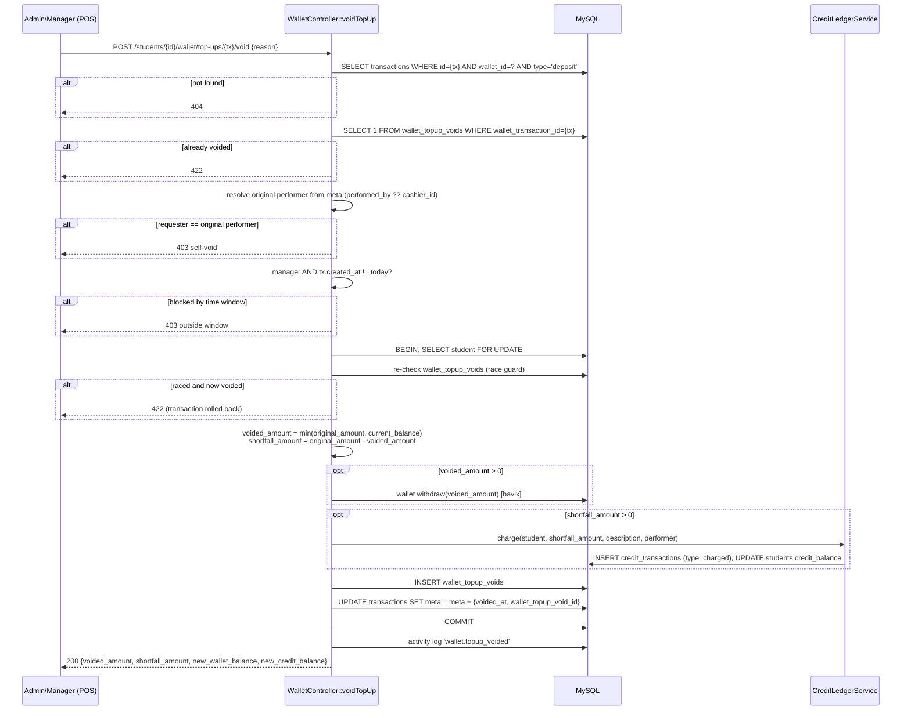
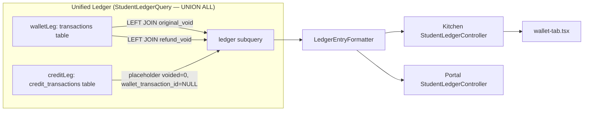

# Design Document — Wallet Top-up Void

## Overview

This feature adds one new endpoint, one new table, one new ledger entry type, and one new POS UI action. It deliberately reuses three pieces of already-merged Spec 14 infrastructure rather than building anything parallel to them:

1. **`CreditLedgerService`** — the shortfall-to-debt conversion calls its existing `charge()` method. No new credit-writing code path is introduced.
2. **`StudentLedgerQuery` / `LedgerEntryType` / `LedgerEntryFormatter`** — the void and its reversal appear as rows in the same unified ledger every other wallet/credit event already flows through, not a second, disconnected history view.
3. **The `SettleCreditDialog` frontend pattern** — the new `VoidTopUpDialog` copies its structure (local Zod schema, `useMutation`, field-level errors, cache invalidation) rather than inventing a new form pattern.

The one genuinely new piece of mechanics is `wallet_topup_voids`: an append-only audit table, structurally identical in spirit to `credit_transactions` (dedicated ledger table, `$timestamps = false`, never updated after creation, written by exactly one code path).

**Key architectural decision — where enforcement logic lives:** Requirements 1–6 specify a strict, sequential enforcement order (resolve → idempotency → self-void → time-window → reason validation → mutation). Unlike `SettleCreditRequest`/`WaiveCreditRequest`, which push business-rule pre-checks into `FormRequest::prepareForValidation()` because they only need the route-bound `$student`, this feature's checks need a **manually resolved, non-route-bound bavix `Transaction` row** and depend on each other in sequence. Splitting that chain across a FormRequest and a controller would obscure the order this spec fixes deliberately. **Decision: `VoidWalletTopUpRequest` validates only the `reason` field. All resolution and business-rule checks live in `WalletController::voidTopUp()`, in the exact order Requirements 1–6 specify, as one readable sequence.**

---

## Architecture





---

## Components and Interfaces

### Backend

#### 1. Migration — `database/migrations/2026_08_03_100000_create_wallet_topup_voids_table.php`

See **Data Models** below for the full schema. Column/FK style matches `2026_05_23_042004_create_credit_transactions_table.php` exactly (same `foreignId()->constrained()` idioms, same `$timestamps = false` convention reflected by omitting `updated_at`).

#### 2. Model — `app/Models/WalletTopupVoid.php`

```php
<?php

namespace App\Models;

use Illuminate\Database\Eloquent\Factories\HasFactory;
use Illuminate\Database\Eloquent\Model;
use Illuminate\Database\Eloquent\Relations\BelongsTo;

/**
 * An immutable record of a voided wallet top-up.
 *
 * Written exclusively by WalletController::voidTopUp(). Never updated after creation —
 * mirrors CreditTransaction's append-only convention. Deliberately does NOT use HasBranch:
 * the global BranchScope would break this table's use from contexts with no active branch
 * bound (e.g. a future cross-branch report), so branch_id stays an explicit snapshot column,
 * matching CreditTransaction's own documented rationale.
 */
class WalletTopupVoid extends Model
{
    use HasFactory;

    public $timestamps = false;

    protected $fillable = [
        'student_id',
        'branch_id',
        'wallet_transaction_id',
        'refund_wallet_transaction_id',
        'credit_transaction_id',
        'original_amount',
        'voided_amount',
        'shortfall_amount',
        'void_reason',
        'voided_by',
        'created_at',
    ];

    protected function casts(): array
    {
        return [
            'original_amount' => 'decimal:2',
            'voided_amount' => 'decimal:2',
            'shortfall_amount' => 'decimal:2',
            'created_at' => 'datetime',
        ];
    }

    public function student(): BelongsTo
    {
        return $this->belongsTo(Student::class);
    }

    public function branch(): BelongsTo
    {
        return $this->belongsTo(Branch::class);
    }

    public function creditTransaction(): BelongsTo
    {
        return $this->belongsTo(CreditTransaction::class);
    }

    public function voidedBy(): BelongsTo
    {
        return $this->belongsTo(User::class, 'voided_by');
    }
}
```

A factory `database/factories/WalletTopupVoidFactory.php` is required (project convention: every new model gets a factory).

#### 3. Form Request — `app/Http/Requests/VoidWalletTopUpRequest.php`

```php
<?php

namespace App\Http\Requests;

use Illuminate\Foundation\Http\FormRequest;

class VoidWalletTopUpRequest extends FormRequest
{
    /**
     * The `role:admin|manager` middleware on the route is the authorization gate.
     * Self-void and time-window checks happen in the controller — see design.md's
     * "where enforcement logic lives" decision.
     */
    public function authorize(): bool
    {
        return true;
    }

    /**
     * @return array<string, mixed>
     */
    public function rules(): array
    {
        return [
            'reason' => ['required', 'string', 'max:500'],
        ];
    }

    protected function prepareForValidation(): void
    {
        if ($this->filled('reason')) {
            $this->merge(['reason' => strip_tags((string) $this->input('reason'))]);
        }
    }
}
```

#### 4. Controller — `app/Http/Controllers/Kitchen/WalletController.php` (new method added to the existing controller)

```php
public function voidTopUp(VoidWalletTopUpRequest $request, Student $student, int $transaction): JsonResponse
{
    $walletId = $student->wallet?->id;
    abort_if($walletId === null, 404, 'Top-up transaction not found.');

    $depositTransaction = DB::table('transactions')
        ->where('id', $transaction)
        ->where('wallet_id', $walletId)
        ->where('type', 'deposit')
        ->where('confirmed', true)
        ->whereNull('deleted_at')
        ->first();

    abort_if($depositTransaction === null, 404, 'Top-up transaction not found.');

    abort_if(
        WalletTopupVoid::where('wallet_transaction_id', $transaction)->exists(),
        422,
        'This top-up has already been voided.'
    );

    $meta = json_decode((string) $depositTransaction->meta, true) ?? [];
    $originalPerformerId = $meta['performed_by'] ?? $meta['cashier_id'] ?? null;
    $originalPerformerId = $originalPerformerId === null ? null : (int) $originalPerformerId;

    abort_if(
        $originalPerformerId === $request->user()->id,
        403,
        'You cannot void a top-up you performed yourself. Ask another admin or manager to void it.'
    );

    $isAdmin = $request->user()->hasRole('admin');
    $createdToday = \Illuminate\Support\Carbon::parse($depositTransaction->created_at)->isToday();

    abort_if(
        ! $isAdmin && ! $createdToday,
        403,
        'This top-up is outside today and can only be voided by an admin.'
    );

    $reason = $request->validated('reason');

    $void = DB::transaction(function () use ($student, $transaction, $meta, $reason, $request) {
        $locked = Student::withoutBranch()->lockForUpdate()->findOrFail($student->id);
        $locked->load('wallet');

        // Race guard: two concurrent void requests for the same transaction both pass the
        // unlocked check above; the loser here fails cleanly instead of double-refunding.
        // The DB-level UNIQUE index on wallet_transaction_id (see migration) is the backstop
        // if this in-transaction check is ever bypassed by a future code path.
        abort_if(
            WalletTopupVoid::where('wallet_transaction_id', $transaction)->exists(),
            422,
            'This top-up has already been voided.'
        );

        $depositTransaction = DB::table('transactions')->where('id', $transaction)->first();
        $originalAmount = round(abs((float) $depositTransaction->amount) / 100, 2);
        $currentBalance = (float) ($locked->wallet?->balanceFloatNum ?? 0.0);

        $voidedAmount = round(min($originalAmount, $currentBalance), 2);
        $shortfallAmount = round($originalAmount - $voidedAmount, 2);

        $refundTransactionId = null;
        if ($voidedAmount > 0) {
            $refundTransaction = $locked->withdraw((int) round($voidedAmount * 100), [
                'source' => 'topup_void_refund',
                'note' => $reason,
                'performed_by' => $request->user()->id,
                'original_wallet_transaction_id' => $transaction,
            ]);
            $refundTransactionId = $refundTransaction->id;
        }

        $creditTransactionId = null;
        if ($shortfallAmount > 0) {
            $creditEntry = app(\App\Services\CreditLedgerService::class)->charge(
                $locked,
                $shortfallAmount,
                "voided top-up #{$transaction}",
                $request->user(),
            );
            $creditTransactionId = $creditEntry->id;
        }

        $void = WalletTopupVoid::create([
            'student_id' => $locked->id,
            'branch_id' => $locked->branch_id,
            'wallet_transaction_id' => $transaction,
            'refund_wallet_transaction_id' => $refundTransactionId,
            'credit_transaction_id' => $creditTransactionId,
            'original_amount' => $originalAmount,
            'voided_amount' => $voidedAmount,
            'shortfall_amount' => $shortfallAmount,
            'void_reason' => $reason,
            'voided_by' => $request->user()->id,
            'created_at' => now(),
        ]);

        DB::table('transactions')->where('id', $transaction)->update([
            'meta' => json_encode(array_merge($meta, [
                'voided_at' => now()->toIso8601String(),
                'wallet_topup_void_id' => $void->id,
            ])),
        ]);

        return $void;
    });

    $student->refresh()->load('wallet');

    activity('wallet')
        ->causedBy($request->user())
        ->performedOn($student)
        ->withProperties([
            'original_amount' => (float) $void->original_amount,
            'voided_amount' => (float) $void->voided_amount,
            'shortfall_amount' => (float) $void->shortfall_amount,
            'void_reason' => $void->void_reason,
            'original_performer_id' => $originalPerformerId,
            'voided_by' => $request->user()->id,
        ])
        ->log('wallet.topup_voided');

    return response()->json([
        'message' => 'Top-up voided successfully.',
        'voided_amount' => (float) $void->voided_amount,
        'shortfall_amount' => (float) $void->shortfall_amount,
        'new_wallet_balance' => (float) ($student->wallet?->balanceFloatNum ?? 0.0),
        'new_credit_balance' => (float) $student->credit_balance,
    ]);
}
```

**Why only the idempotency check is re-verified inside the lock:** self-void (who performed the original deposit) and the time-window check (`created_at`, `hasRole('admin')`) both read data that is immutable once the deposit transaction exists — a transaction's `meta` and `created_at` are never modified by anything except this feature's own `voided_at` annotation, which happens *after* these checks run, and a user's role does not change mid-request. There is nothing for a second request to race against for those two checks, so a single pre-transaction check is sufficient and permanently valid. The "already voided?" check is different: its answer is exactly what this request may itself be about to change, which is the textbook definition of a check that needs re-verification under lock. Do not add redundant re-checks for self-void or the time window inside the transaction — it would be dead code that never catches anything a pre-check didn't already catch.

Required new imports in `WalletController.php`: `App\Http\Requests\VoidWalletTopUpRequest`, `App\Models\WalletTopupVoid`, `Illuminate\Support\Facades\DB`, `Illuminate\Support\Carbon` (or the existing `Carbon\Carbon` — this codebase's other controllers `use Carbon\Carbon;`, e.g. `PaymentController.php`; use that import, not `Illuminate\Support\Carbon`, for consistency — the inline FQCN above is written out only so this snippet doesn't imply a specific import block; the implementation must add a proper `use Carbon\Carbon;` line and call `Carbon::parse(...)`).

`amount` sign note: bavix stores deposit amounts as **positive** integers in minor units (centavos) and withdrawals as negative — this matches the existing `ABS(amount)` handling seen in `StudentLedgerQuery` and `WalletReportController`. This code only ever reads a row already filtered to `type = 'deposit'`, so the amount is expected to already be positive — but wrap the read in `abs()` anyway (`round(abs((float) $depositTransaction->amount) / 100, 2)`), matching the defensive convention every other reader of `transactions.amount` in this codebase already follows, rather than being the one reader that assumes sign without normalizing it.

**Balance accessor note, verified against the installed package** (`vendor/bavix/laravel-wallet/src/Traits/HasWalletFloat.php`): `balanceFloat` is declared `@property string $balanceFloat` — a **string** — while `balanceFloatNum` is declared `@property float $balanceFloatNum`. They are not interchangeable by name alone; `WalletController::topUp()` (the existing sibling method in this same controller) already uses `balanceFloatNum`, so `voidTopUp()` uses it too, consistently, throughout — both for reading the current balance mid-transaction and for the final response. (`CreditLedgerService` and `InlineReloadController` elsewhere in this codebase use `balanceFloat` instead and cast it — that pre-existing inconsistency across files is not introduced by this feature and is out of scope to fix here, but this feature's own new code does not repeat it internally.)

#### 5. Route — `routes/kitchen-api.php`

Add inside the existing `Route::middleware('role:admin|manager')->group(...)` block that already contains `/students/{student}/wallet/top-up` (around line 164), immediately after it:

```php
Route::post('/students/{student}/wallet/top-up', [WalletController::class, 'topUp']);
Route::post('/students/{student}/wallet/top-ups/{transaction}/void', [WalletController::class, 'voidTopUp']);
```

Both routes then share the same `role:admin|manager` gate already in place — no new middleware group needed.

#### 6. `CreditLedgerService::charge()` — parameter rename, behavior-preserving

**Change in `app/Services/CreditLedgerService.php`:**

```php
// Before
public function charge(Student $student, float $amount, string $receiptNumber, User $performer): CreditTransaction
{
    return DB::transaction(function () use ($student, $amount, $receiptNumber, $performer): CreditTransaction {
        $locked = $this->lockStudent($student);
        $charged = round($amount, 2);

        $entry = $this->writeEntry($locked, [
            'type' => CreditTransactionType::Charged,
            'amount' => $charged,
            'notes' => "Credit used for order {$receiptNumber}.",
        ], $performer);
        // ...
```

```php
// After
public function charge(Student $student, float $amount, string $description, User $performer): CreditTransaction
{
    return DB::transaction(function () use ($student, $amount, $description, $performer): CreditTransaction {
        $locked = $this->lockStudent($student);
        $charged = round($amount, 2);

        $entry = $this->writeEntry($locked, [
            'type' => CreditTransactionType::Charged,
            'amount' => $charged,
            'notes' => "Credit used for {$description}.",
        ], $performer);
        // ...
```

Update the docblock above the method (currently references "the order's receipt number" specifically) to describe `$description` generically as "what the credit was charged for," since the caller is no longer always an order.

**Required call-site update in `app/Http/Controllers/Kitchen/CheckoutController.php`** (the only existing caller, per the earlier grep of `->charge(`):

```php
// Before
$this->creditLedger->charge($student, $creditAmount, $receiptNumber, $request->user());

// After
$this->creditLedger->charge($student, $creditAmount, "order {$receiptNumber}", $request->user());
```

This preserves the exact existing notes text `"Credit used for order {$receiptNumber}."` character-for-character — `CreditLedgerServiceTest.php` and any other existing test asserting that string MUST NOT need updating. If any such assertion breaks, that is a signal this change was implemented incorrectly, not that the test needs updating.

My new call site passes `"voided top-up #{$transaction}"`, producing `"Credit used for voided top-up #123."`.

#### 7. `LedgerEntryType` — new case

**`app/Enums/LedgerEntryType.php`:**

```php
enum LedgerEntryType: string
{
    case Deposit = 'deposit';
    case Withdraw = 'withdraw';
    case TopupVoided = 'topup_voided';           // NEW
    case CreditCharged = 'credit_charged';
    case CreditSettled = 'credit_settled';
    case CreditWaived = 'credit_waived';
    case CreditVoided = 'credit_voided';

    public function label(): string
    {
        return match ($this) {
            self::Deposit => 'Top-up',
            self::Withdraw => 'Purchase',
            self::TopupVoided => 'Top-up Voided',   // NEW
            self::CreditCharged => 'Credit Charged',
            self::CreditSettled => 'Credit Paid',
            self::CreditWaived => 'Credit Waived',
            self::CreditVoided => 'Credit Reversed',
        };
    }

    public function direction(): string
    {
        return match ($this) {
            self::Withdraw, self::CreditCharged, self::TopupVoided => 'debit',   // TopupVoided added here
            self::Deposit, self::CreditSettled, self::CreditWaived, self::CreditVoided => 'credit',
        };
    }

    public function isCreditEntry(): bool
    {
        return match ($this) {
            self::CreditCharged, self::CreditSettled, self::CreditWaived, self::CreditVoided => true,
            self::Deposit, self::Withdraw, self::TopupVoided => false,   // TopupVoided added here
        };
    }

    public static function forFilter(string $filter): array
    {
        return match ($filter) {
            'topup' => [self::Deposit, self::TopupVoided],   // TopupVoided added here
            'purchase' => [self::Withdraw],
            'credit' => [self::CreditCharged, self::CreditSettled, self::CreditWaived, self::CreditVoided],
            default => self::cases(),
        };
    }
}
```

Every `match` in this enum is exhaustive (no `default` arm) except `forFilter`, so the PHP compiler itself will error on any `match` left un-updated if `TopupVoided` is added to the enum but forgotten in one of `label()`/`direction()`/`isCreditEntry()` — this is a deliberate existing safety net in the code, not something this design adds.

#### 8. `StudentLedgerQuery` — both legs updated together

**`app/Services/StudentLedgerQuery.php`:**

```php
private function walletLeg(int $walletId): Builder
{
    return DB::table('transactions')
        ->leftJoin('wallet_topup_voids as original_void', 'original_void.wallet_transaction_id', '=', 'transactions.id')
        ->leftJoin('wallet_topup_voids as refund_void', 'refund_void.refund_wallet_transaction_id', '=', 'transactions.id')
        ->selectRaw("
            CONCAT('wallet-', transactions.id) AS row_id,
            transactions.created_at,
            CASE WHEN refund_void.id IS NOT NULL THEN 'topup_voided' ELSE transactions.type END AS entry_type,
            ABS(transactions.amount) / 100.0 AS amount,
            transactions.meta AS details,
            NULL AS payment_method,
            NULL AS reference_number,
            NULL AS order_id,
            NULL AS performed_by,
            CASE WHEN original_void.id IS NOT NULL THEN 1 ELSE 0 END AS voided,
            CASE WHEN transactions.type = 'deposit' THEN transactions.id ELSE NULL END AS wallet_transaction_id
        ")
        ->where('transactions.wallet_id', $walletId)
        ->where('transactions.confirmed', true)
        ->whereNull('transactions.deleted_at');
}

private function creditLeg(Student $student): Builder
{
    return DB::table('credit_transactions')
        ->selectRaw("
            CONCAT('credit-', id) AS row_id,
            created_at,
            CONCAT('credit_', type) AS entry_type,
            amount,
            notes AS details,
            payment_method,
            reference_number,
            order_id,
            performed_by,
            0 AS voided,
            NULL AS wallet_transaction_id
        ")
        ->where('student_id', $student->id);
}
```

**Column parity is mandatory:** both `SELECT` lists must have exactly 11 columns, in the same order, with the same effective types, because `unionAll()` combines them positionally. The two new trailing columns (`voided`, `wallet_transaction_id`) MUST be added to **both** legs in the same change — adding them to only `walletLeg()` breaks the union with a database-level column-count error, not an application-level one. `CreditVoidReversalTest.php`-style coverage (a test that requests `entry_type=all` and asserts the query executes and returns rows) is the regression guard here — see Testing Strategy.

**`wallet_transaction_id` is conditioned on `transactions.type = 'deposit'`, not on the computed `entry_type`.** Do not simplify this to `transactions.id AS wallet_transaction_id` unconditionally — that would also populate it for ordinary purchase (`withdraw`) rows and for the `topup_voided` reversal row itself, neither of which is a target this endpoint accepts (`voidTopUp` only resolves `type = 'deposit'` rows — Requirement 1.2). Requirement 7.5 is explicit that every non-deposit entry gets `null` here; checking the raw `transactions.type` column (rather than the `entry_type` CASE expression computed two lines above it) is both correct and simpler, since a `topup_voided` row's underlying `transactions.type` is always `'withdraw'` regardless of how `entry_type` displays it.

`CONCAT` and `CASE WHEN` are both valid in MySQL 8.0 (production) and SQLite (test suite, per the existing `.0` comment in this same file about SQLite integer division) — no portability risk introduced.

#### 9. `LedgerEntryFormatter` — two new output fields

**`app/Services/LedgerEntryFormatter.php`**, inside `format()`'s returned array:

```php
return [
    'id' => $row->row_id,
    'date' => Carbon::parse($row->created_at)->toIso8601String(),
    'entry_type' => $type->value,
    'entry_label' => $type->label(),
    'direction' => $type->direction(),
    'amount' => round((float) $row->amount, 2),
    'payment_method' => $row->payment_method,
    'reference_number' => $row->reference_number,
    'note' => $note,
    'performed_by' => $performerId === null ? null : ($names[$performerId] ?? null),
    'voided' => (bool) ($row->voided ?? false),                                          // NEW
    'wallet_transaction_id' => $row->wallet_transaction_id !== null                       // NEW
        ? (int) $row->wallet_transaction_id
        : null,
];
```

No change is needed to `resolveNote()` or `performerId()` — the `topup_voided` row is a `walletLeg()` row like any other, so its `note`/`performed_by` already resolve correctly from the `meta` this feature writes (`note` and `performed_by` keys — see controller code above) through the **existing, unmodified** logic in those two methods. This is precisely why the controller writes `note`/`performed_by` into the refund transaction's meta using those exact key names, rather than inventing new ones.

**Parent-facing notes decision (resolves the open question flagged in requirements.md's Out of Scope section):** `$includeStaffOnlyNotes` currently only suppresses notes for `LedgerEntryType::CreditWaived`, because waive reasons can contain sensitive family-circumstance detail. A void reason for a wallet top-up is operational ("entered ₱1000 instead of ₱100") and directly explains a change to the family's own money — **decision: void reasons are NOT added to the staff-only suppression list; parents see them exactly as they see any other note.** If this proves wrong in practice (e.g. staff start writing reasons that reference other people), suppressing `TopupVoided` notes the same way `CreditWaived` notes are suppressed is a one-line change to `format()`'s existing `if (! $includeStaffOnlyNotes && $type === LedgerEntryType::CreditWaived)` condition.

#### 10. `WalletHistoryController::topups()` — `voided` flag added

**`app/Http/Controllers/Kitchen/WalletHistoryController.php`**, in `topups()`:

```php
$transactions = DB::table('transactions')
    ->leftJoin('wallet_topup_voids', 'wallet_topup_voids.wallet_transaction_id', '=', 'transactions.id')
    ->where('transactions.wallet_id', $wallet->id)
    ->where('transactions.type', 'deposit')
    ->where('transactions.confirmed', true)
    ->whereNull('transactions.deleted_at');
```

...and the paginated `select` list (currently `['id', 'amount', 'meta', 'created_at']`, referenced via the `$transactions->paginate($perPage, [...])` call) becomes `['transactions.id', 'transactions.amount', 'transactions.meta', 'transactions.created_at', 'wallet_topup_voids.id as void_id']` (qualifying `id` on both sides is now required because of the join). `formatTopup()` gains a `'voided' => $tx->void_id !== null` key in its returned array. The `$search` clause's `matchingUserIds` sub-query is unaffected — it still filters the top-ups list before this join is even relevant.

#### 11. `WalletReportController` — voided amounts excluded from both deposit and purchase totals

Verified against the actual file (`app/Http/Controllers/Kitchen/WalletReportController.php`). There are exactly **two** SQL blocks to change — not "at least two" — because `buildTxStats()` is a shared private method called by both `index()` (per-student rows) and `export()` (Excel export), so fixing it once fixes both callers:

1. **`$walletSummary`, inline in `index()`, lines 34-43** — branch-level totals, columns `total_credits` (deposits) and `total_debits` (withdrawals/purchases).
2. **`buildTxStats()`, lines 145-168** — per-student totals, columns `total_credited` (deposits) and `total_debited` (withdrawals/purchases). Reused by `index()` for the paginated per-student rows and by `export()` for the Excel report.

Both blocks need **two** corrections each, not one — the deposit side (already covered above in Requirement 9.2) and the withdrawal side (Requirement 9.3), because **the void's own reversal is itself a `type = 'withdraw'` row** and would otherwise inflate "total spent"/"total debited" by the exact amount this feature exists to correct away.

`$walletSummary`'s corrected `selectRaw`, joining `wallet_topup_voids` twice (once per direction, exactly mirroring `StudentLedgerQuery::walletLeg()`'s two-join pattern from Component 8):

```php
$walletSummary = DB::table('transactions')
    ->join('wallets', 'wallets.id', '=', 'transactions.wallet_id')
    ->leftJoin('wallet_topup_voids as original_void', 'original_void.wallet_transaction_id', '=', 'transactions.id')
    ->leftJoin('wallet_topup_voids as refund_void', 'refund_void.refund_wallet_transaction_id', '=', 'transactions.id')
    ->where('wallets.holder_type', Student::class)
    ->whereIn('wallets.holder_id', Student::where('branch_id', $branchId)->select('id'))
    ->whereBetween('transactions.created_at', ["{$dateFrom} 00:00:00", "{$dateTo} 23:59:59"])
    ->selectRaw("
        SUM(CASE
            WHEN transactions.type = 'deposit' THEN ABS(transactions.amount) - COALESCE(original_void.voided_amount * 100, 0)
            ELSE 0
        END) / 100.0 AS total_credits,
        SUM(CASE
            WHEN transactions.type = 'withdraw' AND refund_void.id IS NULL THEN ABS(transactions.amount)
            ELSE 0
        END) / 100.0 AS total_debits
    ")
    ->first();
```

`buildTxStats()` takes the identical two-join, two-CASE-adjustment treatment against its `total_credited`/`total_debited` columns — same joins, same logic, different column aliases. Write it out in full rather than abbreviating; do not assume the pattern "obviously" carries over without writing the actual query, since `buildTxStats()` also has a `GROUP BY wallets.holder_id` that the branch-level query does not, and the join conditions must still resolve correctly per group.

**Do not correct only the deposit side and assume the withdrawal side is unaffected, and do not correct only one of the two SQL blocks and assume the other inherits the fix — they are independent queries with no shared code path except the join pattern itself.**

---

### Frontend (`~/sunbites-pos`)

#### 12. Types — `types/student.ts`

```typescript
export type LedgerEntryType =
  | "deposit"
  | "withdraw"
  | "topup_voided"          // NEW
  | "credit_charged"
  | "credit_settled"
  | "credit_waived"
  | "credit_voided";

export interface LedgerEntry {
  id: string;
  date: string;
  entry_type: LedgerEntryType;
  entry_label: string;
  direction: "debit" | "credit";
  amount: number;
  payment_method: CreditSettlementMethod | null;
  reference_number: string | null;
  note: string | null;
  performed_by: string | null;
  voided: boolean;                    // NEW
  wallet_transaction_id: number | null; // NEW
}

export interface VoidWalletTopUpPayload {
  reason: string;
}

export interface VoidWalletTopUpResponse {
  message: string;
  voided_amount: number;
  shortfall_amount: number;
  new_wallet_balance: number;
  new_credit_balance: number;
}
```

#### 13. API service — `lib/api/students.ts`

Add alongside the existing `topUp` entry in the `studentApi` object:

```typescript
voidTopUp: (studentId: number, walletTransactionId: number, payload: VoidWalletTopUpPayload) =>
  apiClient.post<VoidWalletTopUpResponse>(
    `/students/${studentId}/wallet/top-ups/${walletTransactionId}/void`,
    payload,
  ),
```

Import `VoidWalletTopUpPayload` and `VoidWalletTopUpResponse` from `@/types/student` alongside the existing `StudentLedgerParams`/`StudentLedgerResponse` imports at the top of the file.

#### 14. New component — `app/(kitchen)/students/[id]/_components/void-topup-dialog.tsx`

Structural sibling of `settle-credit-dialog.tsx`, not a modification of it. Props:

```typescript
interface Props {
  open: boolean;
  onClose: () => void;
  studentId: number;
  walletTransactionId: number;
  originalAmount: number;
  currentWalletBalance: number;
}
```

Behavior, mapped directly to Requirement 10:

- Zod schema: `z.object({ reason: z.string().min(1, "A reason is required").max(500, "Reason must be 500 characters or fewer") })`.
- Displays `originalAmount` and `currentWalletBalance` (matching `SettleCreditDialog`'s two-stat header layout).
- `IF currentWalletBalance < originalAmount` renders a warning block: *"₱X.XX of this top-up has already been spent. That amount will be added to the student's outstanding credit instead of refunded from the wallet."* — where `X.XX = (originalAmount - currentWalletBalance).toFixed(2)`, clamped at 0 (never negative; if balance ≥ original amount, no warning renders).
- `useMutation` calling `studentApi.voidTopUp(studentId, walletTransactionId, { reason })`.
- `onSuccess`: invalidate `["student", studentId]` and `["student-ledger", studentId]` query keys (exact keys `SettleCreditDialog` already invalidates — reuse verbatim, do not invent new key shapes), then close and reset the form.
- `onError`: surface `(mutation.error as ApiError)?.message` in the same `mutation.isError && !Object.keys(errors).length` pattern `SettleCreditDialog` uses, so 404/422/403 server messages (Requirement 10.7) render without special-casing per status code.

#### 15. `wallet-tab.tsx` changes

- Import and render `VoidTopUpDialog`, with local `useState` for which transaction (if any) is being voided — mirrors the existing `showSettle` boolean state, but needs to carry the target row's `walletTransactionId` + `original amount`, so use `useState<LedgerEntry | null>(null)` (e.g. `voidTarget`) rather than a boolean, since the dialog needs the row's data.
- In `LedgerRow`, add a "Void" button rendered only `WHEN entry.entry_type === "deposit" && entry.voided === false && canVoidTopUp` — `canVoidTopUp` is a new prop threaded down from `WalletTab` (computed once, not per-row) as `user?.roles.includes("admin") === true || user?.roles.includes("manager") === true`, read via `useAuthStore` — same hook and same boolean-OR pattern already used in `app/(kitchen)/students/[id]/page.tsx` (see design's Security Considerations for the exact precedent line numbers).
- Same-day disable hint (Requirement 10.3): when the current user has `"manager"` but not `"admin"`, and `entry.date` is not today (`new Date(entry.date).toDateString() === new Date().toDateString()`), render the Void button `disabled` with a `title="Only an admin can void a top-up from a previous day."` attribute — this is the one client-side check that needs today's date computed inline; no new hook is introduced for a single date comparison.
- Rows with `voided: true` render with a "Voided" badge (small `<span>` styled like the existing `entry_type.startsWith("credit_")` badge treatment already in `LedgerRow`, reusing the same badge visual language rather than introducing a new badge style) and the amount cell gets a `line-through` utility class added conditionally.
- `entry_type === "topup_voided"` rows need no special-case styling beyond what already exists — `direction === "debit"` already drives the red/minus rendering generically, and `entry_label` from the API already reads "Top-up Voided".

`WalletTab`'s existing props (`studentId`, `walletBalance`, `creditBalance`, `onTopUp`) are unchanged; no new props are added to `WalletTab` itself — the auth-derived `canVoidTopUp` boolean is computed inside `WalletTab` via `useAuthStore`, exactly as `WalletTab` already does not need role props threaded from its parent (it has none today), keeping the parent (`page.tsx`) untouched by this feature.

#### 16. Hook

No new TanStack Query hook file is needed. `useMutation` lives inline inside `VoidTopUpDialog`, exactly as `SettleCreditDialog` and `WaiveCreditDialog` both already do — this codebase's convention for a one-off mutation tied to a single dialog is inline `useMutation`, reserving `hooks/use-*.ts` files for `useQuery`/`useInfiniteQuery` hooks reused across components (`useStudentLedger`, `useWalletHistory`). Introducing a `hooks/use-void-topup.ts` file would break that existing pattern split, not follow it.

---

## Integration Points

| Dependency | Contract this feature relies on | What this feature adds/changes |
|---|---|---|
| `bavix/laravel-wallet` | `$student->deposit()`, `$student->withdraw()`, `transactions` table (`id`, `wallet_id`, `type`, `amount`, `meta`, `confirmed`, `deleted_at`) | Reads `transactions` directly (already an established pattern — `StudentLedgerQuery`, `WalletHistoryController`, `WalletReportController` all do this); writes via `withdraw()` only, never a direct `transactions` write except the explicitly-scoped `meta` annotation update (Requirement 6.3), which touches only the `meta` column and never `amount`/`type`. |
| `App\Services\CreditLedgerService` (Spec 14) | `charge(Student, float, string, User): CreditTransaction`; sole writer of `credit_transactions`/`students.credit_balance` | Consumes `charge()` unchanged in behavior, with its 3rd parameter renamed `$receiptNumber` → `$description` (see Migration & Rollout — this is a signature change, not a new method). |
| `App\Services\StudentLedgerQuery`, `App\Enums\LedgerEntryType`, `App\Services\LedgerEntryFormatter` (Spec 14) | Unified ledger contract: `entry_type`, `entry_label`, `direction`, `voided`\* | Adds `TopupVoided` case; adds `voided` + `wallet_transaction_id` fields to the formatted contract (both API resources, Kitchen and Portal, since both controllers share this formatter — no separate Portal-side change needed). |
| `App\Http\Controllers\Kitchen\WalletController` (Spec 05) | `topUp()` action, `meta` keys `performed_by`, `payment_method`, `reference_number`, `note` | Adds `voidTopUp()` action to the same controller/file. |
| `App\Http\Controllers\Kitchen\InlineReloadController` (Spec 06) | `store()` action, `meta` key `cashier_id` | Unchanged — its deposits become voidable through `WalletController::voidTopUp` without any modification to `InlineReloadController` itself. |
| Frontend `wallet-tab.tsx`, `use-student-ledger.ts`, `lib/api/students.ts` (Spec 14 frontend) | `LedgerEntry` shape, `["student-ledger", studentId]` query key | Extends `LedgerEntry` with two fields; adds one dialog component and one `studentApi` method; invalidates the same existing query keys. |

\* `voided` is a genuinely new field on the ledger contract (not previously exposed); every other field in this row is pre-existing.

---

## Data Models

### `wallet_topup_voids` — new table

`database/migrations/2026_08_03_100000_create_wallet_topup_voids_table.php`:

```php
<?php

use Illuminate\Database\Migrations\Migration;
use Illuminate\Database\Schema\Blueprint;
use Illuminate\Support\Facades\Schema;

return new class extends Migration
{
    public function up(): void
    {
        Schema::create('wallet_topup_voids', function (Blueprint $table) {
            $table->id();
            $table->foreignId('student_id')->constrained()->cascadeOnDelete();
            $table->foreignId('branch_id')->nullable()->constrained()->nullOnDelete();
            $table->unsignedBigInteger('wallet_transaction_id')->unique();
            $table->unsignedBigInteger('refund_wallet_transaction_id')->nullable();
            $table->foreignId('credit_transaction_id')->nullable()->constrained('credit_transactions')->nullOnDelete();
            $table->decimal('original_amount', 10, 2);
            $table->decimal('voided_amount', 10, 2);
            $table->decimal('shortfall_amount', 10, 2)->default(0);
            $table->string('void_reason', 500);
            $table->foreignId('voided_by')->constrained('users');
            $table->timestamp('created_at')->nullable();

            $table->index('refund_wallet_transaction_id');
            $table->index('student_id');
        });
    }

    public function down(): void
    {
        Schema::dropIfExists('wallet_topup_voids');
    }
};
```

Notes on every non-obvious choice:

- **`wallet_transaction_id` is `unique()`, not merely indexed.** This is the DB-level backstop for Requirement 2 (idempotency) — see the controller code's inline comment. `refund_wallet_transaction_id` is only regular-indexed (not unique) because it is nullable and, while it will in practice always be unique when non-null (one refund per void), nothing depends on the database enforcing that — the uniqueness that matters for correctness is on `wallet_transaction_id` (the thing being protected from double-voiding), not on its refund.
- **No FK constraint on `wallet_transaction_id`/`refund_wallet_transaction_id`.** They reference bavix's package-owned `transactions` table, which this app does not control the migrations for — this matches `credit_transactions.wallet_transaction_id`'s existing precedent exactly (plain `unsignedBigInteger`, no `constrained()`).
- **`branch_id` is nullable with `nullOnDelete()`**, matching `credit_transactions.branch_id`'s exact precedent from the Spec 14 migration.
- **`credit_transaction_id` uses `nullOnDelete()`** rather than `cascadeOnDelete()` — a `credit_transactions` row is never actually deleted by any code path in this application (it is an append-only ledger, same as this new table), so the delete-behavior choice is largely theoretical, but `nullOnDelete()` is the safer default for an audit trail: if a credit transaction row were ever removed by some future maintenance script, the void record should survive with a null pointer rather than being cascaded away itself.
- **`void_reason` is `string(500)` not `text`**, matching the `max:500` validation rule and matching `TransactionController::void`'s and `PaymentController::void`'s existing `void_reason` validation length exactly — consistency with the two existing "void" precedents in this codebase, not with `credit_transactions.notes`, which was widened to `text` for a different reason (up to 1000-character waive reasons).
- **No `updated_at`.** `WalletTopupVoid::$timestamps = false`, matching `CreditTransaction`.

### Modified tables

None. This feature adds no columns to `transactions`, `credit_transactions`, `students`, or any other existing table. The only existing-row mutation is the `meta` JSON annotation on the specific `transactions` row being voided (Requirement 6.3), performed via `DB::table('transactions')->where('id', $transaction)->update(['meta' => ...])` — a targeted, single-row, single-column update, not a schema change.

---

## Security Considerations

- **Authorization model per endpoint:** `role:admin|manager` route middleware (Requirement 4.1) is the primary gate, consistent with every other financial-mutation route in `kitchen-api.php` (`PaymentController::void` uses the identical gate). Self-void (Requirement 3) and the manager same-day window (Requirement 4.2-4.3) are *additional* controller-level checks layered on top of the role gate — role membership alone is necessary but not sufficient.
- **Frontend gating is UX only.** The client-side `canVoidTopUp` boolean (Component 15) and the same-day disabled-button hint exist purely so staff without permission don't see an action that will 403 — removing or bypassing them client-side (e.g. via browser devtools) changes nothing about what the server will accept. This mirrors the existing precedent at `app/(kitchen)/students/[id]/page.tsx:2480` (`canWaiveCredit`), which is UX-only in exactly the same way for the existing waive-credit action.
- **Data isolation:** the void endpoint operates on `{student}`, which is resolved through Laravel's route-model binding against the `Student` model — `Student` uses `HasBranch`, so a request for a student outside the requester's active branch already 404s before `voidTopUp()` executes, via the existing global `BranchScope`. No new branch-isolation code is needed in this feature; it inherits Student's existing scoping for free. `wallet_topup_voids.branch_id` itself is a plain snapshot column (not `HasBranch`-scoped) purely for report-query correctness (see Cross-Cutting Requirements in requirements.md) — it is not a security boundary.
- **No new PII exposure.** `void_reason` is staff-authored free text, same category of data as `void_reason` on `Order` and `StudentMonthlyPayment` today, both of which are already staff-writable and already surfaced to staff. The one new decision (Component 9) is that it also surfaces to *parents* — evaluated above and judged low-risk because it is inherently about a change to the family's own money, not about a third party.
- **Idempotency doubles as a safety mechanism, not just correctness:** the `UNIQUE` constraint on `wallet_transaction_id` means even a bug that somehow bypassed every application-level check could not produce two refunds for the same top-up — the database itself refuses the second `INSERT`.

---

## Migration & Rollout

- **Schema change:** one new table (`wallet_topup_voids`), no changes to existing tables' structure. Purely additive — safe to deploy ahead of the application code that uses it (the table sitting unused for a few minutes during a rolling deploy is harmless).
- **Backward compatibility:** `CreditLedgerService::charge()`'s third parameter is renamed `$receiptNumber` → `$description` with **identical runtime behavior** at the one existing call site once `CheckoutController` is updated in the same change (Component 6). This is not a backward-compatible-by-itself change — **the `CreditLedgerService::charge()` signature change and the `CheckoutController` call-site update MUST ship in the same deploy**, or `CheckoutController` breaks (wrong string interpolated into `notes`, though not a runtime error since PHP doesn't enforce parameter name matching — only the resulting `notes` text would silently become wrong: `"Credit used for 12345."` instead of `"Credit used for order 12345."` if the call site is left unquoted with a bare receipt number). Because this is a same-repo, same-deploy change with no independent versioning between caller and callee, this is a non-issue in practice — flagged here only so the implementer does not split this into two separate PRs.
- **No dependency updates.** No new Composer or npm packages are introduced by this feature.
- **Rollback plan:** the migration's `down()` drops `wallet_topup_voids` cleanly (no other table references it via FK). Rolling back the application code without rolling back the migration is also safe — an unused table with no writers is inert. Rolling back the migration *without* first rolling back the application code would break `voidTopUp()` (table not found) but nothing else — no other endpoint reads or writes `wallet_topup_voids`.
- **Feature flag / phased rollout:** none used or needed — this is an additive staff-facing action gated by existing role middleware, not a change to any existing user-facing flow. There is nothing to phase.

---

## Error Handling

| Scenario | Requirement | HTTP status | Response |
|---|---|---|---|
| `{transaction}` doesn't exist, belongs to another student's wallet, or is a `withdraw`-type row | 1.2 | 404 | `{"message": "Top-up transaction not found."}` |
| `reason` missing or empty | 1.4 | 422 | `{"message": "...", "errors": {"reason": ["The reason field is required."]}}` |
| `{transaction}` already has a `wallet_topup_voids` row | 2.1 | 422 | `{"message": "This top-up has already been voided."}` |
| Requester is the original top-up's performer | 3.2 | 403 | `{"message": "You cannot void a top-up you performed yourself. Ask another admin or manager to void it."}` |
| Requester is `manager` (not `admin`) and the top-up is not from today | 4.2 | 403 | `{"message": "This top-up is outside today and can only be voided by an admin."}` |
| Requester is `supervisor` or `cashier` | 4.1 | 403 | Laravel's default role-middleware response (unchanged — this feature adds no new handling here, the existing `role:` middleware already produces this) |
| Student has no wallet at all | (implicit — no deposit can exist without a wallet) | 404 | Same message as "transaction not found" — a student with no wallet has no deposit transactions, so this collapses into the same 404 rather than needing a distinct message |
| Race: two concurrent void requests for the same transaction | 2.2 | First succeeds 200; second gets 422 "already voided" (from the in-transaction re-check) or, if that re-check were ever bypassed, a 500 from the DB unique-constraint violation — the in-transaction re-check exists specifically so this always resolves to a clean 422, not a 500 | See controller code, Component 4 |

All 422s from `abort_if(...)` in the controller (as opposed to `FormRequest` validation failures) return the bare `{"message": "..."}` shape, not a `{"errors": {...}}` shape — consistent with how `TransactionController::void`'s "already voided" check (`if ($order->status === OrderStatus::Voided) { return response()->json(['message' => ...], 422); }`) and `PaymentController::void`'s `abort_if` calls already behave.

---

## Testing Strategy

Per `testing.md`: Feature tests, real database, `RefreshDatabase`, `actingAs($user, 'sanctum')`, factories over manual instantiation, happy path + failure path + edge case for every rule.

### Backend — `tests/Feature/Kitchen/WalletTopUpVoidTest.php` (new file, naming consistent with `VoidPaymentTest.php` / `CreditVoidReversalTest.php`)

1. **Happy path — full recovery:** admin voids a top-up where the full amount is still in the wallet. Assert: wallet balance decreases by the original amount, `wallet_topup_voids` row created with `voided_amount = original_amount`, `shortfall_amount = 0`, `credit_transaction_id` null, no `credit_transactions` row created, response shape matches Error Handling / controller contract, activity log entry exists with `wallet.topup_voided`.
2. **Partial spend — shortfall becomes credit debt:** top up ₱1000, spend ₱700 via checkout, void the ₱1000 top-up. Assert: wallet balance goes to 0 (not negative), `voided_amount = 300`, `shortfall_amount = 700`, a `credit_transactions` row of `type=charged, amount=700` exists, `students.credit_balance` increased by 700, `wallet_topup_voids.credit_transaction_id` points at it.
3. **Full spend — nothing recoverable:** top up ₱100, spend the full ₱100, void it. Assert: no `withdraw()` call occurs (`refund_wallet_transaction_id` is null), `shortfall_amount = 100`, credit debt of 100 created.
4. **Credit-limit exemption:** set `credit_limit` config to a low value (e.g. 50), have the student already at/near that limit via an unrelated charge, then void a top-up whose shortfall would push `credit_balance` past the configured limit. Assert the void still succeeds (200) and `credit_balance` legitimately exceeds `credit_limit` afterward — this is the test that proves Requirement 5.5's exemption is actually wired, not merely asserted in a comment.
5. **Idempotency:** void a top-up once (200), void the same `{transaction}` again (422, message asserted), assert no second `wallet_topup_voids` row, no double withdrawal, no double credit charge.
6. **Self-void blocked:** the same user who performed the top-up (via `WalletController::topUp`) attempts to void it → 403, no mutation occurred (assert wallet balance unchanged, no `wallet_topup_voids` row).
7. **Self-void blocked via inline reload's `cashier_id` key:** same as (6) but the original deposit was created via `InlineReloadController::store` (which writes `cashier_id`, not `performed_by`) — proves the fallback key resolution (Requirement 3.1) actually works, not just the primary key.
8. **Self-void NOT blocked when original performer is unknown:** manually seed a `transactions` row with `meta` containing neither `performed_by` nor `cashier_id` (simulating a legacy/malformed row), then void it as any admin/manager — assert it succeeds (Requirement 3.3's explicit edge case).
9. **Same-day window — manager blocked:** seed a deposit with `created_at` set to yesterday, attempt void as a `manager` → 403 with the window message, no mutation.
10. **Same-day window — admin unrestricted:** same seed, void as `admin` → 200.
11. **Same-day window — manager allowed for today's own transaction (not self-performed):** two different managers — manager A performs the top-up, manager B voids it same-day → 200 (proves the window check and the self-void check are independent and both correctly pass when they should).
12. **Role gate — supervisor/cashier blocked:** `actingAs` a supervisor and a cashier separately, both get the standard role-middleware 403, no controller code executes (assert no `wallet_topup_voids` row either way).
13. **Not found — wrong student's wallet:** create two students with wallets, attempt to void student A's transaction id via student B's route → 404.
14. **Not found — withdraw-type transaction:** attempt to void a transaction id that is a genuine purchase deduction (`type=withdraw`) → 404 (proves the `type='deposit'` filter, not just wallet ownership, is enforced).
15. **Validation — missing reason:** omit `reason` → 422 with field error.
16. **Original transaction meta annotated:** after a successful void, assert the original `transactions` row's `meta` now contains `voided_at` and `wallet_topup_void_id`, and that its `amount`/`type` are byte-for-byte unchanged (Requirement 6.3's non-destructive update guarantee).
17. **Unified ledger integration:** after voiding, call `GET /students/{id}/ledger?entry_type=all` and assert: the original deposit row has `voided: true`; a new row with `entry_type: "topup_voided"`, `direction: "debit"`, `entry_label: "Top-up Voided"`, `note` equal to the void reason, and `performed_by` equal to the voider's name exists; a `credit_charged` row exists if a shortfall occurred. Also call with `entry_type=topup` specifically and assert both the `deposit` and `topup_voided` rows are present (Requirement 7.7) — and call with `entry_type=purchase` and assert the `topup_voided` row is **absent** (proves it isn't miscategorized as a purchase, the exact bug this design's `entry_type` CASE expression exists to prevent).
18. **`CreditLedgerServiceTest.php` regression check (existing file, not new):** run the existing suite after the `charge()` signature rename and confirm the existing assertion of `"Credit used for order {$receiptNumber}."` still passes unchanged — proves the `CheckoutController` call-site update (Component 6) preserved exact backward-compatible output.
19. **`WalletHistoryController`/`WalletReportController` regression + new coverage:** existing tests for these controllers (locate via `tests/Feature/Kitchen/` — likely covered under a `WalletReport*Test.php` or similar; if no dedicated file exists today, add one) must still pass, plus new assertions: a voided top-up appears in `WalletHistoryController::topups()`'s list with `voided: true`; `WalletReportController`'s deposit totals (`total_credits`, `total_credited`) reflect only the unvoided remainder; and — the assertion most likely to be forgotten — `WalletReportController`'s purchase totals (`total_debits`, `total_debited`) do **not** include the void's own reversal withdrawal, in both `index()` and `export()`.
20. **Parent notification on shortfall (Requirement 5.7):** using `Notification::fake()`, void a top-up with a shortfall and assert a `CreditChargedNotification` was sent to the student's linked parent(s) — proving the inherited side effect of reusing `CreditLedgerService::charge()` unmodified actually fires, not just that it's documented. Also assert a void with **no** shortfall (`voided_amount = original_amount`) sends **no** such notification, since `charge()` is never called in that path.

### Frontend — `void-topup-dialog.test.tsx` (new, sibling to `settle-credit-dialog.test.tsx`) and `wallet-tab.test.tsx` (existing, extended)

Per `testing.md`: RTL + MSW, `render`/`screen` from `__tests__/test-utils.tsx`, `getByRole`/`getByLabelText` queries, no `getByTestId`.

`void-topup-dialog.test.tsx`:
1. Renders original amount and current wallet balance when opened.
2. Shows the "already spent" warning only when `currentWalletBalance < originalAmount`, not otherwise.
3. Submit is disabled with an empty reason; typing a reason enables it.
4. Reason longer than 500 characters shows a field-level Zod error and does not submit.
5. Successful submission (MSW mock 200) invalidates `["student", studentId]` and `["student-ledger", studentId]`, then closes the dialog.
6. Server error (MSW mock 403 self-void message) keeps the dialog open and renders the server's message text.
7. Submit button is disabled while the mutation is pending (`mutation.isPending`).

`wallet-tab.test.tsx` additions:
1. "Void" button renders on a `deposit`/`voided:false` row when the mocked `useAuthStore` user has `roles: ["admin"]`; does not render when `roles: ["cashier"]`.
2. "Void" button does not render at all on a row with `voided: true` (renders a "Voided" badge instead).
3. For a `manager`-only user, the button is present but `disabled` on a row whose `date` is not today, with the explanatory `title` present.
4. Clicking "Void" opens `VoidTopUpDialog` with the correct `walletTransactionId`/`originalAmount` props (assert via the dialog's rendered content, e.g. the amount shown, not via internal prop inspection).
